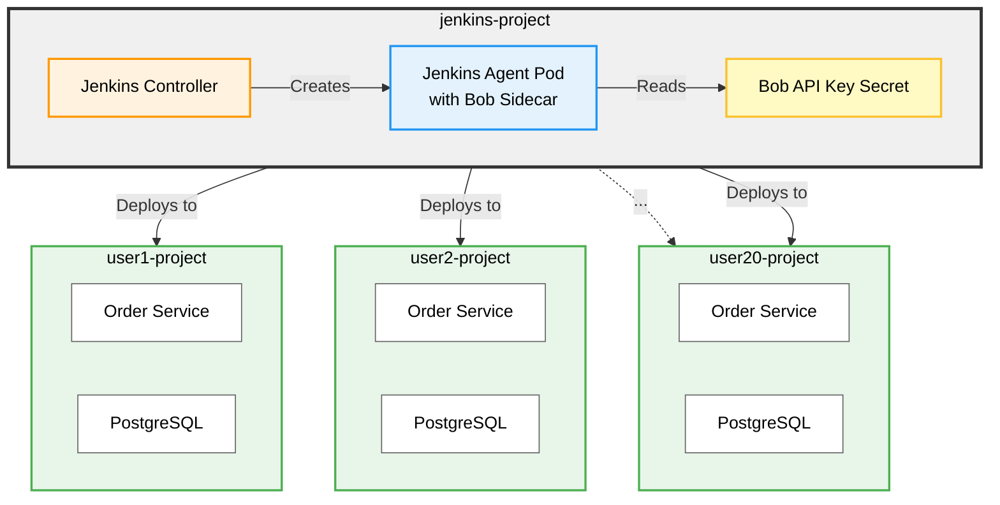

# Multi-User Jenkins Setup with Bob Sidecar - Implementation Plan

## Executive Summary

**YES, this architecture is feasible and recommended for your 20-user lab environment.**

The proposed architecture is not only possible but follows Kubernetes/OpenShift best practices. This plan details how to implement a single Jenkins instance with Bob CLI as a sidecar container in Jenkins agent pods, serving 20 isolated user projects.

---

## Architecture Overview



---

## Key Design Decisions

| Aspect | Decision | Rationale |
|--------|----------|-----------|
| **Jenkins Location** | Single instance in `jenkins-project` | Centralized management, resource efficiency |
| **Bob Location** | Sidecar in each Jenkins agent pod | Standard Kubernetes pattern, Bob available during pipeline execution |
| **API Key Strategy** | Single shared Bob API key in a Secret | Rotatable mid-event without code changes |
| **User Isolation** | Jenkins folder RBAC + OpenShift RBAC | Users see only their own Jenkins folder; users have NO OpenShift role on `jenkins-project` |
| **Naming Convention** | `user1` through `user20` | Clear, predictable naming for automation |
| **Prompt Storage** | One file per prompt in `pipeline/prompts/` | Keeps Jenkinsfile readable; prompts are reviewable, diffable, and reusable across pipelines |
| **`askBob` Signature** | `askBob(promptName, vars = [:], mode = null)` | Loads prompt by name, substitutes `${VAR}` placeholders, optionally selects a Bob mode (e.g. `sre-operator`) |
| **Custom Bob Modes** | Project-level modes in repo's `.bob/`, auto-loaded via shared workspace | Per-lab modes ship with the branch; participants can read them; no image rebuild needed when a mode changes |

---

## Project Structure

### Projects to Create

1. **`jenkins-project`** - Hosts Jenkins controller and shared resources
2. **`user1-project`** through **`user20-project`** - Individual user workspaces

### Resource Distribution

```
jenkins-project/
├── Jenkins Controller (DeploymentConfig)
├── Jenkins Service & Route
├── Bob API Key Secret (shared)
├── Jenkins Agent Image (BuildConfig)
├── Bob CLI Image (BuildConfig)
└── ServiceAccount with cross-project permissions

user{N}-project/
├── Order Service (Deployment)
├── PostgreSQL (Deployment)
├── Services & Routes
└── ServiceAccount (default)

repo/
├── Jenkinsfile                       # uses askBob('name', [VAR:val], mode)
└── pipeline/prompts/                 # prompt-per-file, version-controlled
    ├── pr-analysis.md
    ├── lint-failure.md
    ├── pci-failure.md
    ├── test-failure.md
    ├── security-scan.md
    ├── dcr.md
    ├── smoke-failure.md
    └── dcr-update.md
```

---

## Workflow: Progressive Stages with Manual Commits

This implementation runs in 11 stages on a dedicated branch (`multi_user_implementation`). Each stage is independently testable. The rules:

1. **One stage at a time.** Complete the stage's work and run its test/validation step.
2. **Commit manually.** After validation, review the diff and create the commit using the suggested message.
3. **Wait for explicit confirmation.** Claude does not begin the next stage until you say "committed" (or equivalent). The "⏸ Stop" marker at the end of each stage is a hard stop.
4. **If a stage fails its test**, fix it inside the same stage — do not advance and squash later.

This gives clean, reviewable commits and lets you bail out at any stage without leaving half-finished work behind.

---

## Implementation Plan

### Stage 0 — Working branch

**Goal:** Isolate this work from `main`.

**Status:** ✅ Already on branch `multi_user_implementation`.

**Verify:**
```bash
git branch --show-current   # should print: multi_user_implementation
git status                  # should be clean before starting Stage 1
```

**Commit:** None — no changes in this stage.

---

### Stage 1 — Extract Jenkinsfile prompts to `pipeline/prompts/`

**Goal:** Lift every inline Bob prompt out of the Jenkinsfile into its own file under `pipeline/prompts/`. Use `${VAR}` placeholders for values supplied by the pipeline.

**Steps:**
1. Create `pipeline/prompts/`.
2. For each inline prompt in `labs/solution/Jenkinsfile.solution`, create one file:

   | File | Source (line in `Jenkinsfile.solution`) | Placeholders |
   |------|-----------------------------------------|--------------|
   | `pr-analysis.md`     | line 77  | `${BRANCH}`, `${CHANGED_FILES}` |
   | `lint-failure.md`    | line 114 | `${LINT_OUTPUT}` |
   | `pci-failure.md`     | line 141 | `${PCI_OUTPUT}` |
   | `test-failure.md`    | line 188 | `${TEST_SUMMARY}`, `${TEST_OUTPUT}` |
   | `security-scan.md`   | line 226 | `${SCAN_OUTPUT}` |
   | `dcr.md`             | line 261 | `${BRANCH}`, `${PCI_STATUS}`, `${TEST_STATUS}`, `${SECURITY_RISK}` |
   | `smoke-failure.md`   | line 418 | `${SMOKE_OUTPUT}` |
   | `dcr-update.md`      | line 449 | `${DCR}`, `${DEPLOY_STATUS}`, `${SMOKE_OUTPUT}` |

3. Do **not** modify the Jenkinsfile yet. This stage is files-only so it can ship independently.

**Test:** `ls pipeline/prompts/` shows all 8 files. Open 2–3 files and confirm content matches the original prompts (placeholders substituted for the inline `${...}` Groovy interpolations).

**Commit message:**
```
Extract Bob prompts from Jenkinsfile into pipeline/prompts/

Each of the 8 prompts previously inlined in labs/solution/Jenkinsfile.solution
now lives in its own .md file under pipeline/prompts/. Pipeline-supplied values
are represented as ${VAR} placeholders so the prompts can be rendered with a
template substitution helper in a follow-up commit. No pipeline behavior change
in this commit — askBob is still inline.
```

⏸ **Stop.** Confirm commit before moving on.

---

### Stage 2 — Refactor `askBob` to read prompt files and accept a mode

**Goal:** Replace the inline-prompt `askBob(prompt)` with `askBob(promptName, vars = [:], mode = null)`. Update all callers. Still works against the existing per-user Bob pod (no infra changes yet) so the refactor is independently testable.

**Steps:**
1. Replace the helper at the bottom of `labs/solution/Jenkinsfile.solution` with:

   ```groovy
   // ── Helper: ask Bob CLI a question ──────────────────────────────────────
   // promptName: filename (without extension) under pipeline/prompts/
   // vars: map of ${VAR} placeholder substitutions
   // mode: optional Bob mode slug (e.g. 'sre-operator')
   def askBob(promptName, vars = [:], mode = null) {
       def template = readFile("pipeline/prompts/${promptName}.md")
       def rendered = template
       vars.each { k, v ->
           rendered = rendered.replace('${' + k + '}', v == null ? '' : v.toString())
       }

       def renderedFile = ".bob-prompt-${System.currentTimeMillis()}.txt"
       writeFile(file: renderedFile, text: rendered)

       def modeFlag = mode ? "--mode ${mode}" : ""

       // NOTE: this stage still uses the per-user Bob pod via oc exec.
       // Stage 6 swaps this for the sidecar container('bob-cli') { ... } form.
       def bobPod = sh(
           script: "oc get pods -l component=bob-cli -o jsonpath='{.items[0].metadata.name}' 2>/dev/null",
           returnStdout: true
       ).trim()
       if (!bobPod) {
           sh "rm -f ${renderedFile}"
           return "Bob CLI not available"
       }
       sh "oc cp ${renderedFile} ${bobPod}:/tmp/bob-prompt.txt 2>/dev/null"
       def result = sh(
           script: "oc exec ${bobPod} -- bash -c 'bob -p \"\$(cat /tmp/bob-prompt.txt)\" ${modeFlag} --hide-intermediary-output' 2>/dev/null || echo 'Bob analysis unavailable'",
           returnStdout: true
       ).trim()

       sh "rm -f ${renderedFile}"
       return result
   }
   ```

2. Update the 8 callers. Examples:
   ```groovy
   env.BOB_PR_ANALYSIS = askBob('pr-analysis', [
       BRANCH: params.BRANCH,
       CHANGED_FILES: env.CHANGED_FILES
   ])

   env.DCR_SUMMARY = askBob('dcr', [
       BRANCH: params.BRANCH,
       PCI_STATUS: pciStatus,
       TEST_STATUS: testStatus,
       SECURITY_RISK: env.SECURITY_RISK
   ], 'sre-operator')
   ```

**Test:** Run `sre-pipeline` on the **existing** single-user Bob pod setup against `lab/happy-path` (or current test branch). Verify all 8 Bob calls produce non-empty output. Compare a successful run's `BOB_*` env vars against a baseline pre-refactor run — content should be substantively similar.

**Commit message:**
```
Refactor askBob to load prompts from pipeline/prompts/ and accept a mode

askBob now takes (promptName, vars, mode):
- reads pipeline/prompts/${promptName}.md
- substitutes ${VAR} placeholders from the vars map
- adds --mode <slug> when supplied (e.g. 'sre-operator')

All 8 callers in Jenkinsfile.solution updated to the new signature. Still
targets the existing per-user bob-cli pod via oc exec — sidecar migration
happens in a later stage so this refactor is independently testable.
```

⏸ **Stop.** Confirm commit before moving on.

---

### Stage 3 — Stand up `jenkins-project` namespace + Jenkins controller

**Goal:** Shared Jenkins controller running in its own namespace, reachable via Route, OAuth login working.

**Steps:**
```bash
oc new-project jenkins-project
oc new-app jenkins-persistent \
    --param MEMORY_LIMIT=4Gi \
    --param VOLUME_CAPACITY=10Gi \
    --param ENABLE_OAUTH=true
oc rollout status dc/jenkins -n jenkins-project --timeout=300s
```
Save the commands as `scripts/01-jenkins-project.sh`.

**Test:**
- `oc get route jenkins -n jenkins-project -o jsonpath='{.spec.host}'` returns a hostname.
- Open the URL in a browser; "Log in with OpenShift" succeeds for cluster admin.
- Jenkins dashboard loads (empty).

**Commit message:**
```
Add jenkins-project namespace + Jenkins controller setup script

scripts/01-jenkins-project.sh provisions the shared jenkins-project
namespace and deploys Jenkins via the jenkins-persistent template with
OAuth enabled. Persistent volume and 4Gi memory limit chosen for the
20-user lab capacity target.
```

⏸ **Stop.** Confirm commit before moving on.

---

### Stage 4 — Create Bob API key Secret

**Goal:** API key stored in a rotatable Secret in `jenkins-project`. Key is supplied at run time via env var, never committed.

**Steps:**
```bash
# scripts/02-bob-secret.sh
#!/usr/bin/env bash
set -euo pipefail
: "${BOBSHELL_API_KEY:?must be set}"
oc create secret generic bob-api-key \
    --from-literal=BOBSHELL_API_KEY="$BOBSHELL_API_KEY" \
    -n jenkins-project
```
Document rotation in the Security Considerations section (already present).

**Test:**
- `oc get secret bob-api-key -n jenkins-project` returns the secret.
- `oc extract secret/bob-api-key --to=- -n jenkins-project` returns the key value (sanity check, then clear terminal).

**Commit message:**
```
Add Bob API key Secret provisioning script

scripts/02-bob-secret.sh creates the bob-api-key Secret in jenkins-project
from the BOBSHELL_API_KEY env var. The key itself is never committed; a
rotation runbook lives in the Security Considerations section of the plan.
```

⏸ **Stop.** Confirm commit before moving on.

---

### Stage 5 — Build custom Jenkins agent + Bob CLI images in `jenkins-project`

**Goal:** Both images live in the `jenkins-project` internal registry and are pullable by agent pods.

**Steps:**
```bash
# scripts/03-build-images.sh
oc -n jenkins-project new-build --binary --name=sre-jenkins-agent --strategy=docker
oc -n jenkins-project start-build sre-jenkins-agent --from-dir=k8s/openshift/jenkins-agent --follow

oc -n jenkins-project new-build --binary --name=sre-bob-cli --strategy=docker
oc -n jenkins-project start-build sre-bob-cli --from-dir=k8s/openshift/bob-cli --follow
```

**Test:**
- `oc -n jenkins-project get is` shows both `sre-jenkins-agent` and `sre-bob-cli` with a tag.
- Run a one-off pod using each image and confirm the entrypoint is sane:
  ```bash
  oc -n jenkins-project run agent-test --rm -it --restart=Never \
      --image=image-registry.openshift-image-registry.svc:5000/jenkins-project/sre-jenkins-agent:latest \
      -- /bin/bash -c "java -version && oc version --client"

  oc -n jenkins-project run bob-test --rm -it --restart=Never \
      --image=image-registry.openshift-image-registry.svc:5000/jenkins-project/sre-bob-cli:latest \
      -- bob --version
  ```

**Commit message:**
```
Add image build script for Jenkins agent and Bob CLI in jenkins-project

scripts/03-build-images.sh creates BuildConfigs for sre-jenkins-agent and
sre-bob-cli and triggers binary builds against the existing Dockerfiles
under k8s/openshift/. Both images land in the jenkins-project internal
registry where the dynamic agent pod will pull them.
```

⏸ **Stop.** Confirm commit before moving on.

---

### Stage 6 — Switch Jenkinsfile to a Kubernetes agent pod with Bob sidecar

**Goal:** Pipeline runs in a pod with `pipeline-agent` + `bob-cli` containers. `askBob` calls Bob via `container('bob-cli')` instead of `oc exec`.

**Steps:**
1. Replace the `agent { kubernetes { yaml ... } }` block in the Jenkinsfile with the two-container pod spec below:

   ```groovy
   agent {
       kubernetes {
           yaml """
   apiVersion: v1
   kind: Pod
   metadata:
     labels:
       jenkins-agent: sre-pipeline
   spec:
     serviceAccountName: jenkins
     containers:
     # Main pipeline agent
     - name: pipeline-agent
       image: image-registry.openshift-image-registry.svc:5000/jenkins-project/sre-jenkins-agent:latest
       command: ['sleep']
       args: ['infinity']
       env:
       - name: HOME
         value: /home/jenkins
       resources:
         requests:
           memory: "512Mi"
           cpu: "250m"
         limits:
           memory: "1Gi"
           cpu: "1"
     # Bob CLI sidecar
     - name: bob-cli
       image: image-registry.openshift-image-registry.svc:5000/jenkins-project/sre-bob-cli:latest
       command: ['sleep']
       args: ['infinity']
       env:
       - name: BOBSHELL_API_KEY
         valueFrom:
           secretKeyRef:
             name: bob-api-key
             key: BOBSHELL_API_KEY
       - name: BOB_ACCEPT_LICENSE
         value: "true"
       - name: HOME
         value: /home/jenkins/agent
       resources:
         requests:
           memory: "512Mi"
           cpu: "100m"
         limits:
           memory: "1Gi"
           cpu: "500m"
   """
           defaultContainer 'pipeline-agent'
       }
   }
   ```

2. Replace the `askBob` body so the bob CLI invocation runs inside `container('bob-cli')`:
   ```groovy
   def askBob(promptName, vars = [:], mode = null) {
       def template = readFile("pipeline/prompts/${promptName}.md")
       def rendered = template
       vars.each { k, v ->
           rendered = rendered.replace('${' + k + '}', v == null ? '' : v.toString())
       }

       def renderedFile = ".bob-prompt-${System.currentTimeMillis()}.txt"
       writeFile(file: renderedFile, text: rendered)

       def modeFlag = mode ? "--mode ${mode}" : ""
       def result = container('bob-cli') {
           sh(
               script: "bob -p \"\$(cat ${renderedFile})\" ${modeFlag} --hide-intermediary-output",
               returnStdout: true
           ).trim()
       }

       sh "rm -f ${renderedFile}"
       return result
   }
   ```
3. Create a tiny one-stage smoke pipeline (e.g. `pipeline/prompts/smoke-hello.md` with content `Reply with the single word "alive".`) and a job that just calls `askBob('smoke-hello')` — used only to validate this stage in isolation.

**Test:**
- Trigger the smoke pipeline as Jenkins admin in `jenkins-project`.
- Inspect the resulting pod (`oc -n jenkins-project get pods`) — should see two containers.
- Build log shows `alive` (or similar) returned from Bob.
- Then trigger the full `sre-pipeline` and verify all 8 Bob calls succeed via the sidecar.

**Commit message:**
```
Switch Jenkinsfile agent to kubernetes pod with Bob sidecar

The dynamic agent pod now runs two containers: pipeline-agent (build/oc
work) and bob-cli (Bob CLI with the API key from the bob-api-key Secret).
askBob switches from `oc exec` against a per-user Bob pod to a
`container('bob-cli')` block inside the same pod, using the workspace
volume that the kubernetes plugin already shares between containers.

A smoke prompt + job is added under pipeline/prompts/smoke-hello.md to
validate the sidecar in isolation before any user projects exist.
```

⏸ **Stop.** Confirm commit before moving on.

---

### Stage 7 — First user project (`user1-project`) + RBAC + app deployment

**Goal:** `user1-project` exists, has order-service + db running, Jenkins ServiceAccount can deploy to it, the OpenShift user `user1` has edit on `user1-project` only.

**Steps:**
```bash
# scripts/04-create-user-project.sh
USER=$1
PROJECT="${USER}-project"
oc new-project "$PROJECT"
oc label namespace "$PROJECT" lab-user="$USER" lab-type=participant
oc policy add-role-to-user edit \
    system:serviceaccount:jenkins-project:jenkins -n "$PROJECT"
oc policy add-role-to-user edit "$USER" -n "$PROJECT"
# IMPORTANT: do NOT grant any role to "$USER" on jenkins-project.
```

```bash
# scripts/05-deploy-user-app.sh
USER=$1
PROJECT="${USER}-project"
oc -n "$PROJECT" apply -f k8s/order-db-deployment.yaml
oc -n "$PROJECT" apply -f k8s/order-db-service.yaml
oc -n "$PROJECT" new-build --binary --name=order-service-build --strategy=docker
oc -n "$PROJECT" start-build order-service-build --from-dir=order-service --follow
IMAGE="image-registry.openshift-image-registry.svc:5000/${PROJECT}/order-service-build:latest"
sed "s|IMAGE_PLACEHOLDER|${IMAGE}|g" k8s/order-service-deployment.yaml | oc -n "$PROJECT" apply -f -
oc -n "$PROJECT" apply -f k8s/order-service-service.yaml
oc -n "$PROJECT" expose svc/order-service
```

Run for user1: `./scripts/04-create-user-project.sh user1 && ./scripts/05-deploy-user-app.sh user1`.

**Test:**
- `oc -n user1-project get pods` shows db + order-service ready.
- Curl the order-service Route — returns expected response.
- Impersonate user1: `oc --as=user1 get pods -n user1-project` succeeds; `oc --as=user1 get pods -n jenkins-project` is **denied**.
- From `jenkins-project`, run `oc -n user1-project rollout restart deployment/order-service` as the Jenkins SA — succeeds.

**Commit message:**
```
Add per-user project provisioning + first user (user1)

scripts/04-create-user-project.sh and scripts/05-deploy-user-app.sh
provision a participant's namespace, deploy order-service + postgres,
grant the Jenkins SA edit on it, and grant the OpenShift user edit on
their own namespace only — explicitly NO role on jenkins-project.

Run end-to-end for user1 to validate: db + service deploy cleanly,
user1 has access to user1-project but is denied jenkins-project.
```

⏸ **Stop.** Confirm commit before moving on.

---

### Stage 8 — First Jenkins folder + pipeline job for user1, with folder RBAC + OAuth

**Goal:** user1 logs into Jenkins via OpenShift OAuth, sees ONLY the `user1` folder, runs `sre-pipeline` against `user1-project`, Bob calls succeed.

**Steps:**
1. In Jenkins (`jenkins-project`):
   - Install / enable the **OpenShift Login** plugin.
   - Set authorization strategy to **Role-Based Strategy**.
2. Run a Groovy init script (or JCasC) that creates the `user1` folder and the parameterized `sre-pipeline` job inside, with `Item.Read/Build/Cancel` granted only to the Jenkins user `user1`. Save as `scripts/06-create-jenkins-folder.groovy` (parameterized by user).
3. The pipeline job sets `USER_PROJECT` default to `user1-project` and uses `params.USER_PROJECT` in deploy stages.

**Test:**
- Log out of Jenkins admin. Log in via OAuth as `user1`.
- Confirm user1 sees ONLY the `user1` folder — no other folders, no system jobs.
- Trigger `sre-pipeline` from inside `user1`'s folder.
- Pipeline pod comes up in `jenkins-project` with both containers; pipeline deploys to `user1-project`; all 8 Bob calls succeed.
- `oc --as=user1 get pods -n jenkins-project` is still denied — confirming Jenkins UI access does not require any OpenShift role on `jenkins-project`.

**Commit message:**
```
Add Jenkins OAuth + folder RBAC + first user (user1) job

OpenShift Login plugin and Role-Based Strategy are now the auth path:
users authenticate to Jenkins as their OpenShift identity through the
public Jenkins Route — no OpenShift role on jenkins-project required.

scripts/06-create-jenkins-folder.groovy provisions a per-user folder
with Item.Read/Build/Cancel granted to that user only, plus a
parameterized sre-pipeline job inside that folder targeting the user's
own namespace. Validated end-to-end with user1.
```

⏸ **Stop.** Confirm commit before moving on.

---

### Stage 9 — Scale to 3 users (user2, user3) and validate concurrency

**Goal:** Confirm isolation and concurrency hold under multi-user load before going wide.

**Steps:**
- For user2 and user3, run scripts 04, 05, and 06.
- Optionally rebuild the per-user pipeline jobs from a single loop in `scripts/07-bulk-create.sh`.

**Test:**
- Log in as each of user1/user2/user3 in separate browsers.
- Each sees only their own folder.
- Trigger all three pipelines within the same minute.
- All three deploy to their own namespace; no cross-project deployments.
- Watch Bob API for any rate-limit headers/errors during the concurrent burst.

**Commit message:**
```
Scale to 3 users and validate concurrency + isolation

scripts/07-bulk-create.sh wraps the per-user provisioning + folder
creation in a loop. Validated with 3 concurrent pipeline runs from
distinct OpenShift users — each pipeline targets only its own
user{N}-project namespace and Jenkins folder; no cross-tenant access
observed. Bob API showed no rate limiting at this scale.
```

⏸ **Stop.** Confirm commit before moving on.

---

### Stage 10 — Scale to all 20 users + add quotas, network policies, key rotation prep

**Goal:** Full event capacity with operational guardrails in place.

**Steps:**
1. Run `scripts/07-bulk-create.sh` for user4 through user20.
2. Apply the resource quota loop from "Security Considerations" to every user namespace.
3. Apply the NetworkPolicy template to every user namespace (deny cross-user traffic).
4. Pre-stage a rotation API key: store as `bob-api-key-standby` Secret so a rotation is one `oc patch` away during the event.

**Test:**
- 20 user namespaces present, all with quotas + network policies.
- Drive 5 concurrent pipeline runs across distinct users; measure pod CPU/memory and watch Bob API for throttling.
- Confirm rotation runbook works on `bob-api-key-standby` in a dry-run swap (then swap back).

**Commit message:**
```
Scale to 20 users + apply quotas, network policies, and rotation key

All participant namespaces user1-project through user20-project provisioned
with edit grants for the Jenkins SA and the corresponding OpenShift user.
Per-namespace ResourceQuota caps pods/cpu/memory to prevent one user from
starving the cluster. NetworkPolicy denies cross-user pod-to-pod traffic
while still allowing jenkins-project agent pods to reach the user's
order-service and database.

Rotation key staged as bob-api-key-standby so the live key can be swapped
mid-event with a single oc patch + dc/jenkins rollout restart.
```

⏸ **Stop.** Confirm commit before declaring the rollout complete.

---

## Per-Lab Custom Bob Modes

Each lab can define its own Bob mode (custom role definition + rules + tool permissions) without rebuilding any container image. The mechanism falls naturally out of the design we already have.

### How it works

1. **Bob discovers project modes from the workspace.** When the `bob` CLI starts, it reads `.bob/custom_modes.yaml` and `.bob/rules-<slug>/` from its current working directory.
2. **The workspace is shared with the sidecar.** The Jenkins Kubernetes plugin mounts the same workspace volume into every container in the agent pod (this is also what makes `askBob` work — see Stage 6). When the pipeline runs `checkout scm`, the repo's `.bob/` directory lands in the workspace and becomes visible to the `bob-cli` sidecar.
3. **`askBob` already accepts the mode.** The signature `askBob(promptName, vars, mode)` from Stage 2 passes `--mode <slug>` to the CLI when `mode` is supplied. Nothing else to wire up.

The result: a lab adds a mode by adding files to its branch. The next pipeline run on that branch sees the new mode automatically. Participants can `cat .bob/custom_modes.yaml` or `ls .bob/rules-lab-N/` to see exactly what's shaping Bob's behavior — the mode is a first-class part of the lab content, not hidden inside an image.

### File layout for a per-lab mode

For a hypothetical `lab-2-pr-review` mode:

```
.bob/
├── custom_modes.yaml                  # add the lab-2-pr-review entry here
└── rules-lab-2-pr-review/             # mode-specific rules, loaded alphabetically
    ├── 01-review-checklist.md
    ├── 02-pci-considerations.md
    └── 03-output-format.md
```

`custom_modes.yaml` entry:

```yaml
customModes:
  # ... existing modes (sre-operator, etc.)
  - slug: lab-2-pr-review
    name: Lab 2 — PR Review
    description: Reviews pull requests for the Lab 2 exercise
    roleDefinition: |
      You are a code reviewer focused on the Lab 2 exercise...
    whenToUse: Use during Lab 2 to analyze the submitted PR.
    groups:
      - read
      - - edit
        - fileRegex: \.(yaml|yml|sh|groovy)$
          description: Pipeline and config files only
      - command
    customInstructions: |
      - Reference the lab brief in labs/LAB_BOB_PIPELINE.md
      - Output findings as a numbered list with file:line references
```

Pipeline call:

```groovy
env.LAB2_REVIEW = askBob('pr-analysis', [
    BRANCH: params.BRANCH,
    CHANGED_FILES: env.CHANGED_FILES
], 'lab-2-pr-review')
```

### Project modes vs. baked-in global modes

Two places a mode can live. Pick based on how often it changes and who owns it:

| Where | Loaded from | Best for | Trade-off |
|-------|-------------|----------|-----------|
| **Project mode** (this repo's `.bob/`) | Workspace, per pipeline run | Per-lab modes that change with lab content; modes participants should be able to read | Tied to the branch — only available when that branch is checked out |
| **Global mode** (baked into the Bob CLI image at `~/.bob/custom_modes.yaml`) | The `sre-bob-cli` image | Foundational modes used across every lab (e.g., `sre-operator`) | Changing a mode requires rebuilding and redeploying the image |

Recommended split: keep the foundational `sre-operator` mode baked into the image so it's always present, and put each lab's mode in `.bob/` in the repo so labs can iterate on them independently.

### Adding a new lab mode (mini-checklist)

This is a small change but it follows the same staged-commit rhythm as the rest of this plan.

1. Create `.bob/rules-<lab-slug>/` and write the rule files.
2. Append the mode entry to `.bob/custom_modes.yaml`.
3. Update the relevant `askBob(...)` callsite in the Jenkinsfile to pass the new mode slug.
4. **Test:** run the pipeline on a branch that includes the new mode files. Verify in the build log that Bob's response reflects the new role definition / rules. Confirm `bob -p "what mode are you in?" --mode <slug>` returns the expected mode when run inside the bob-cli container.
5. **Commit:** `Add <lab-slug> Bob mode and wire it into <stage> stage`
6. ⏸ Wait for confirmation before moving on.

### Caveat: rule loading order

Rules in `.bob/rules-<slug>/` load alphabetically. If ordering matters (e.g., a constraint must be stated before the workflow that depends on it), prefix filenames with `01-`, `02-`, etc. — the existing `.bob/rules-sre-operator/` directory uses this convention.

---

## Security Considerations

### 1. API Key Rotation
```bash
# To rotate the Bob API key:
oc delete secret bob-api-key -n jenkins-project
oc create secret generic bob-api-key \
    --from-literal=BOBSHELL_API_KEY="new-api-key-here" \
    -n jenkins-project

# Restart Jenkins to pick up new secret
oc rollout restart dc/jenkins -n jenkins-project
```

### 2. Network Policies (Optional)
Restrict communication between user projects:

```yaml
apiVersion: networking.k8s.io/v1
kind: NetworkPolicy
metadata:
  name: deny-cross-user-traffic
  namespace: user1-project
spec:
  podSelector: {}
  policyTypes:
  - Ingress
  ingress:
  - from:
    - namespaceSelector:
        matchLabels:
          name: user1-project
    - namespaceSelector:
        matchLabels:
          name: jenkins-project
```

### 3. Resource Quotas
Prevent resource exhaustion:

```bash
for i in {1..20}; do
    oc create quota user${i}-quota \
        --hard=pods=10,requests.cpu=2,requests.memory=4Gi,limits.cpu=4,limits.memory=8Gi \
        -n user${i}-project
done
```

---

## Advantages of This Architecture

### ✅ Resource Efficiency
- **Single Jenkins instance** instead of 20 separate instances
- **Single Bob API key** instead of 20 keys
- **Shared agent images** reduce storage requirements
- **Dynamic agent pods** scale up/down based on demand

### ✅ Simplified Management
- **Centralized Jenkins configuration** - update once, affects all users
- **Single Bob CLI image** to maintain
- **Consistent pipeline behavior** across all users
- **Easy to add/remove users** - just create/delete projects

### ✅ Better User Experience
- **Isolated Jenkins views** - users only see their own jobs
- **Consistent Bob performance** - shared sidecar pattern
- **No cross-project interference** - RBAC enforced at OpenShift level
- **Familiar workflow** - same Jenkinsfile works for all users

### ✅ Production-Ready Pattern
- **Kubernetes-native** - uses standard sidecar pattern
- **Scalable** - can easily support more users
- **Secure** - proper RBAC and secret management
- **Observable** - centralized logging and monitoring

---

## Operational Risks

### ⚠️ Top risk: Bob API rate limits during the event
20 participants sharing a single API key, all running pipelines in the same window, is the most likely thing to break this setup. Treat this as a launch blocker, not a "potential challenge":

- **Confirm the rate limit on the key before the event** and divide it by expected concurrent pipeline runs (assume worst case: all 20 at once).
- **Have a rotation/fallback key ready.** The Secret-based design already supports rotation — pre-stage a second key and document the swap as a one-command runbook.
- **Set per-folder build concurrency limits in Jenkins** so a single user can't queue 10 pipeline runs and starve the others.
- If the limit looks tight, request a higher quota or provision 2–3 keys and round-robin them via separate Secrets per cohort.

---

## Potential Challenges & Solutions

### Challenge 1: Jenkins Agent Pod Startup Time
**Problem:** Each pipeline run creates a new pod with Bob sidecar, adding startup overhead.

**Solutions:**
- Use `imagePullPolicy: IfNotPresent` to cache images
- Pre-pull images to all nodes: `oc adm prune images`
- Consider persistent agents for frequently-used pipelines

### Challenge 2: User Authentication
**Problem:** Users need to authenticate to both Jenkins and OpenShift.

**Solutions:**
- Enable OpenShift OAuth for Jenkins (single sign-on) — users hit the Jenkins Route, get bounced through OpenShift login, and land back in Jenkins authenticated as their OpenShift identity. No second account to manage.
- Provide clear documentation for the login flow

### Challenge 3: Concurrent Pipeline Runs
**Problem:** Multiple users running pipelines simultaneously.

**Solutions:**
- Set Jenkins executor limits appropriately
- Configure resource requests/limits on agent pods
- Monitor cluster capacity and scale nodes if needed

---

## Maintenance Procedures

### Adding a New User
Re-uses the same scripts introduced in Stages 7 and 8:
```bash
./scripts/04-create-user-project.sh user21
./scripts/05-deploy-user-app.sh user21
# Create the Jenkins folder + pipeline job for the new user
# (the Groovy script from Stage 8, parameterized by user)
./scripts/06-create-jenkins-folder.groovy user21
```

### Removing a User
```bash
# Delete the Jenkins folder for the user (via Jenkins UI or Groovy)
# Delete the OpenShift project
oc delete project user5-project
```

### Updating Bob CLI
```bash
# Rebuild the Bob CLI image (BuildConfig named `sre-bob-cli`, created in Stage 5)
oc -n jenkins-project start-build sre-bob-cli --from-dir=k8s/openshift/bob-cli --follow

# No Jenkins restart needed — the next pipeline run pulls the new image
# into a fresh agent pod.
```

---

## Cluster Resource Footprint

This section is about **cluster RAM/CPU only** — Bob API spend is unaffected by which pattern you pick. API cost is driven by how many `bob -p` calls the pipeline makes per run, which is identical in both designs (8 calls per `sre-pipeline` run today, regardless of where Bob runs).

Comparing against the realistic alternative (shared Jenkins + one long-running Bob pod per user project):

### Alternative: per-user Bob pod
- 1 Jenkins controller × 4Gi = 4Gi
- 20 long-running Bob pods × 512Mi = 10Gi
- **Cluster RAM baseline: ~14Gi always-on**

### This plan: Bob as ephemeral sidecar
- 1 Jenkins controller × 4Gi = 4Gi
- Bob sidecars only exist while a pipeline run is in flight
- Peak (5 concurrent pipelines): 5 × (1Gi agent + 1Gi Bob limit) = ~10Gi
- **Cluster RAM baseline: ~4Gi. Peak: ~14Gi.**

The wins, in order of importance:
1. **One image to maintain instead of 20 deployments to keep healthy.** This is the main operational benefit.
2. **Cluster RAM frees up between pipeline runs** (~10Gi), since Bob sidecars terminate when the pipeline pod does. Useful if the cluster also runs other workloads.
3. **Single Secret to rotate** instead of 20 Bob pod restarts when the API key changes.

What this does **not** affect: API cost, API rate limits, or per-user behavior. With one shared API key (the chosen design), rate-limit risk is identical in both patterns — see Operational Risks for the mitigations.

---

## Conclusion

**This architecture is not only feasible but highly recommended for your use case.**

### Key Takeaways:
1. ✅ **Bob as sidecar in Jenkins agents** is the correct pattern
2. ✅ **Single shared API key in a Secret** works for lab environments — rate-limit risk is the thing to watch (see Operational Risks)
3. ✅ **Jenkins folder RBAC + OpenShift OAuth** isolates users without giving them any role on `jenkins-project`
4. ✅ **Operational simplicity** — one Bob CLI image to maintain, one Secret to rotate, ~10Gi cluster RAM freed between pipeline runs
5. ✅ **Production-ready pattern** that scales beyond 20 users

### Next Steps:
1. Review this plan.
2. Begin **Stage 0** of the Implementation Plan (create the working branch).
3. Work the stages in order. Commit each stage manually after its test passes; Claude waits for explicit "committed" before starting the next stage.
4. Stages 7–9 are the natural validation gates — pause after Stage 9 to confirm everything looks good before scaling to the full 20 users in Stage 10.

The architecture follows Kubernetes best practices and leverages OpenShift's built-in RBAC for security — this is the right approach for a multi-user lab environment.