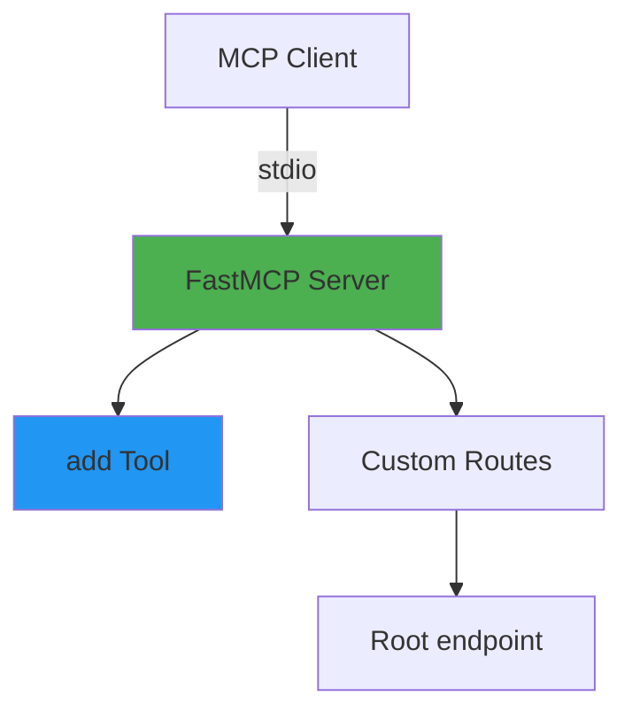

# Simple Calculator MCP Server

Minimal single-file MCP server implementation demonstrating core concepts.

## Architecture



## Features

- Single-file architecture
- Basic calculator tool
- stdio transport
- Custom HTTP routes

## Installation

```bash
cd 01-simple-calculator

# Create virtual environment
python -m venv venv

# Activate virtual environment
# On macOS/Linux:
source venv/bin/activate
# On Windows:
# venv\Scripts\activate

# Install dependencies
pip install -r requirements.txt
```

## Usage

### With MCP Client (Bob)

1. **Navigate to Bob Settings**
   - Open Bob's settings/preferences

2. **Navigate to MCP Servers**
   - Find the MCP Servers section in settings

3. **Open Configuration File**
   - Choose either Local (project-specific) or Global configuration
   - Click to open the configuration file

4. **Add Server Configuration**
   
   **For Local Configuration** (project-specific `.bob/mcp.json`):
   ```json
   {
     "mcpServers": {
       "simple-calculator": {
         "command": "/absolute/path/to/example-mcp-servers/01-simple-calculator/venv/bin/python",
         "args": ["/absolute/path/to/example-mcp-servers/01-simple-calculator/server.py"]
       }
     }
   }
   ```
   
   **For Global Configuration** (`~/Library/Application Support/IBM Bob/User/globalStorage/ibm.bob-code/settings/mcp_settings.json` on macOS):
   ```json
   {
     "mcpServers": {
       "simple-calculator": {
         "command": "/absolute/path/to/example-mcp-servers/01-simple-calculator/venv/bin/python",
         "args": ["/absolute/path/to/example-mcp-servers/01-simple-calculator/server.py"]
       }
     }
   }
   ```
   
   **For Windows users**, use the Windows path format:
   ```json
   {
     "mcpServers": {
       "simple-calculator": {
         "command": "C:\\absolute\\path\\to\\example-mcp-servers\\01-simple-calculator\\venv\\Scripts\\python.exe",
         "args": ["C:\\absolute\\path\\to\\example-mcp-servers\\01-simple-calculator\\server.py"]
       }
     }
   }
   ```
   
   > **Note:** Replace `/absolute/path/to/example-mcp-servers` with the actual path to this repository on your system. The `command` should point to the Python executable inside the virtual environment (`venv/bin/python` on macOS/Linux or `venv\Scripts\python.exe` on Windows) to ensure all dependencies are available.

5. **Restart Bob**
   - Restart Bob to load the new MCP server configuration

6. **Verify Server Status**
   - Check that the MCP server shows a green indicator light
   - The server should appear in Bob's MCP servers list
   
   > **Note:** If you see import errors for `fastmcp` or `starlette` in your editor, this is normal. The server uses the virtual environment where these packages are installed, so as long as the MCP server indicator light is green, everything is working correctly.

### How to Use This Server

Once configured, switch to **Advanced mode** (or any mode with MCP capabilities) and try:

```
"Use the calculator MCP to add 8 and 8 together"
```

Bob will use the `add` tool from this MCP server to perform the calculation.

### Standalone Server (Optional)

```bash
python server.py
```

Server runs with stdio transport for MCP protocol communication.

## Available Tools

- `add(a: int, b: int) -> int` - Add two numbers

## Testing

```bash
# Server status
curl http://127.0.0.1:8080/

# Expected response:
# {"status": "ok", "message": "Basic MCP Server is running", "endpoints": {"sse": "/sse"}}
```

## Code Structure

Single file containing:
- Server initialization
- Tool definitions
- Custom routes
- Logging configuration

Suitable for prototypes and learning MCP basics.