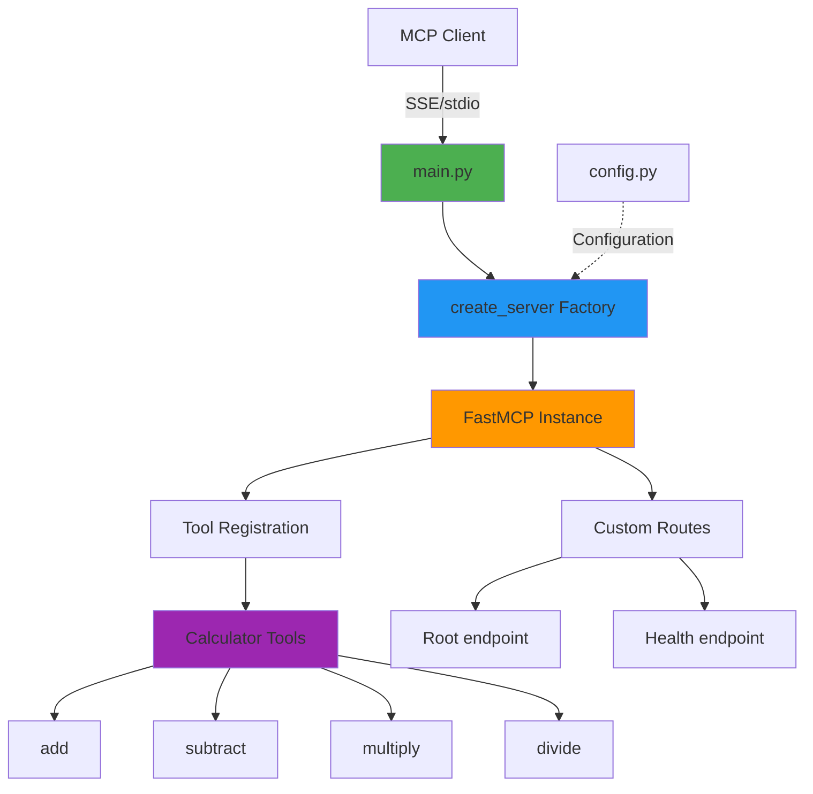

# Structured Calculator MCP Server

Production-ready MCP server with modular package architecture.

## Architecture



## Features

- Python package structure
- Separation of concerns
- Factory pattern
- Modular tool registration
- Configuration management
- Health check endpoints

## Installation

```bash
cd 02-structured-calculator

# Create virtual environment
python -m venv venv

# Activate virtual environment
# On macOS/Linux:
source venv/bin/activate
# On Windows:
# venv\Scripts\activate

# Install dependencies
pip install -r requirements.txt
```

## Usage

### With MCP Client (Bob)

1. **Navigate to Bob Settings**
   - Open Bob's settings/preferences

2. **Navigate to MCP Servers**
   - Find the MCP Servers section in settings

3. **Open Configuration File**
   - Choose either Local (project-specific) or Global configuration
   - Click to open the configuration file

4. **Add Server Configuration**
   
   **For Local Configuration** (project-specific `.bob/mcp.json`):
   ```json
   {
     "mcpServers": {
       "structured-calculator": {
         "command": "/absolute/path/to/example-mcp-servers/02-structured-calculator/venv/bin/python",
         "args": ["/absolute/path/to/example-mcp-servers/02-structured-calculator/main.py"]
       }
     }
   }
   ```
   
   **For Global Configuration** (`~/Library/Application Support/IBM Bob/User/globalStorage/ibm.bob-code/settings/mcp_settings.json` on macOS):
   ```json
   {
     "mcpServers": {
       "structured-calculator": {
         "command": "/absolute/path/to/example-mcp-servers/02-structured-calculator/venv/bin/python",
         "args": ["/absolute/path/to/example-mcp-servers/02-structured-calculator/main.py"]
       }
     }
   }
   ```
   
   **For Windows users**, use the Windows path format:
   ```json
   {
     "mcpServers": {
       "structured-calculator": {
         "command": "C:\\absolute\\path\\to\\example-mcp-servers\\02-structured-calculator\\venv\\Scripts\\python.exe",
         "args": ["C:\\absolute\\path\\to\\example-mcp-servers\\02-structured-calculator\\main.py"]
       }
     }
   }
   ```
   
   > **Note:** Replace `/absolute/path/to/example-mcp-servers` with the actual path to this repository on your system. The `command` should point to the Python executable inside the virtual environment (`venv/bin/python` on macOS/Linux or `venv\Scripts\python.exe` on Windows) to ensure all dependencies are available.

5. **Restart Bob**
   - Restart Bob to load the new MCP server configuration

6. **Verify Server Status**
   - Check that the MCP server shows a green indicator light
   - The server should appear in Bob's MCP servers list
   
   > **Note:** If you see import errors for `fastmcp` or `starlette` in your editor, this is normal. The server uses the virtual environment where these packages are installed, so as long as the MCP server indicator light is green, everything is working correctly.

### How to Use This Server

Once configured, switch to **Advanced mode** (or any mode with MCP capabilities) and try:

```
"Use the structured calculator to multiply 15 by 4"
```

Bob will use the appropriate tool from this MCP server to perform the calculation.

### Extra Abilities

This server includes additional operations beyond the simple calculator:
- Subtraction
- Multiplication
- Division with error handling for division by zero

### Standalone Server (Optional)

```bash
python main.py
```

Server runs with stdio transport for MCP protocol communication (same as when launched by Bob).

## Available Tools

- `add(a: int, b: int) -> int`
- `subtract(a: int, b: int) -> int`
- `multiply(a: int, b: int) -> int`
- `divide(a: int, b: int) -> float`

## Testing

```bash
# Server status
curl http://127.0.0.1:8080/

# Health check
curl http://127.0.0.1:8080/health
```

## Project Structure

```
02-structured-calculator/
├── main.py              # Entry point
├── mcp_server/
│   ├── __init__.py      # Package exports
│   ├── config.py        # Configuration
│   ├── server.py        # Server factory
│   └── tools/
│       ├── __init__.py  # Tool registration
│       └── calculator.py
```

## Extending

Add new tools:
1. Create tool file in `mcp_server/tools/`
2. Define tools with `@mcp.tool()` decorator
3. Register in `tools/__init__.py`

Configuration changes go in `config.py`.