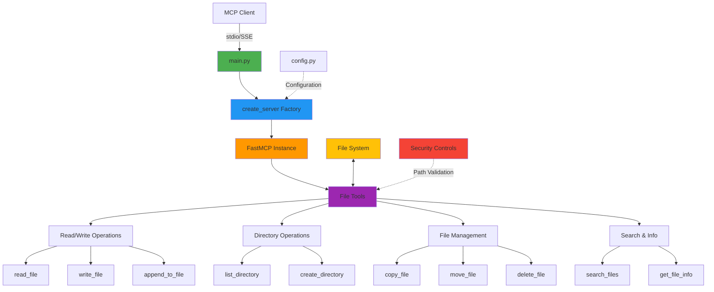

# Lab 03: File Operations MCP Server


## Architecture


MCP server for file system operations with security controls.

## Features

- Read/write files with line range support
- Directory listing (recursive with patterns)
- File search with regex
- Copy/move/delete operations
- File metadata and statistics
- Path validation and security controls

## Installation

```bash
cd 03-file-operations

# Create virtual environment
python -m venv venv

# Activate virtual environment
# On macOS/Linux:
source venv/bin/activate
# On Windows:
# venv\Scripts\activate

# Install dependencies
pip install -r requirements.txt
```

## Usage

### With MCP Client (Bob)

1. **Navigate to Bob Settings**
   - Open Bob's settings/preferences

2. **Navigate to MCP Servers**
   - Find the MCP Servers section in settings

3. **Open Configuration File**
   - Choose either Local (project-specific) or Global configuration
   - Click to open the configuration file

4. **Add Server Configuration**
   
   **For Local Configuration** (project-specific `.bob/mcp.json`):
   ```json
   {
     "mcpServers": {
       "file-ops": {
         "command": "/absolute/path/to/example-mcp-servers/03-file-operations/venv/bin/python",
         "args": ["/absolute/path/to/example-mcp-servers/03-file-operations/main.py"],
         "env": {
           "FILE_BASE_PATH": "/path/to/workspace"
         }
       }
     }
   }
   ```
   
   **For Global Configuration** (`~/Library/Application Support/IBM Bob/User/globalStorage/ibm.bob-code/settings/mcp_settings.json` on macOS):
   ```json
   {
     "mcpServers": {
       "file-ops": {
         "command": "/absolute/path/to/example-mcp-servers/03-file-operations/venv/bin/python",
         "args": ["/absolute/path/to/example-mcp-servers/03-file-operations/main.py"]
       }
     }
   }
   ```
   
   **For Windows users**, use the Windows path format:
   ```json
   {
     "mcpServers": {
       "file-ops": {
         "command": "C:\\absolute\\path\\to\\example-mcp-servers\\03-file-operations\\venv\\Scripts\\python.exe",
         "args": ["C:\\absolute\\path\\to\\example-mcp-servers\\03-file-operations\\main.py"]
       }
     }
   }
   ```
   
   > **Note:** Replace `/absolute/path/to/example-mcp-servers` with the actual path to this repository on your system. The `command` should point to the Python executable inside the virtual environment (`venv/bin/python` on macOS/Linux or `venv\Scripts\python.exe` on Windows) to ensure all dependencies are available.

5. **Restart Bob**
   - Restart Bob to load the new MCP server configuration

6. **Verify Server Status**
   - Check that the MCP server shows a green indicator light
   - The server should appear in Bob's MCP servers list
   
   > **Note:** If you see import errors for `fastmcp` or `starlette` in your editor, this is normal. The server uses the virtual environment where these packages are installed, so as long as the MCP server indicator light is green, everything is working correctly.

### How to Use This Server

Once configured, switch to **Advanced mode** (or any mode with MCP capabilities) and try:

```
"Use the file operations MCP to list all files in the current directory"
```

Bob will use the file system tools to list the directory contents.

> **Important:** Bob has built-in file reading capabilities, so you must explicitly specify to use the custom MCP server in your first request. Otherwise, Bob will default to its built-in file tools instead of your custom MCP server. It has worked for me so far that after the first request its stated, all other requests are made with the custom MCP server. 

### Extra Abilities

This server provides comprehensive file system operations:

- **File Reading & Writing**: Read and write files with advanced options
  - Example: `"Show me lines 10 through 50 of config.json"`
  - Example: `"Write 'Hello World' to a new file called greeting.txt"`
  - Example: `"Append a new log entry to logs/app.log"`

- **Directory Operations**: List and create directories with pattern matching
  - Example: `"List all Python files in the src directory"`
  - Example: `"Show me all files in the project recursively"`
  - Example: `"Create a new directory called 'backups/2024'"`

- **File Search**: Search file contents using regex patterns
  - Example: `"Search for all TODO comments in Python files"`
  - Example: `"Find all files containing 'API_KEY' in the config directory"`
  - Example: `"Search for email addresses in all text files"`

- **File Management**: Copy, move, and delete operations with safety checks
  - Example: `"Copy config.json to config.backup.json"`
  - Example: `"Move all .log files to the logs directory"`
  - Example: `"Delete all temporary files with .tmp extension"`

- **File Metadata**: Get detailed information about files
  - Example: `"What's the size and last modified date of database.db?"`
  - Example: `"Show me the file permissions for script.sh"`
  - Example: `"Get information about all files in the uploads folder"`

### Standalone Server (Optional)

```bash
python main.py
```

Server runs with stdio transport for MCP protocol communication (same as when launched by Bob).

## Available Tools

### File Reading & Writing
- `read_file(path: str, start_line: int = 0, end_line: int = -1)` - Read file with line range
- `write_file(path: str, content: str, mode: str = "w")` - Write or append
- `delete_file(path: str)` - Delete file

### Directory Operations
- `list_directory(path: str = ".", recursive: bool = False, pattern: str = "*")` - List files
- `create_directory(path: str)` - Create directory with parents

### File Management
- `copy_file(source: str, destination: str)` - Copy file
- `move_file(source: str, destination: str)` - Move/rename file
- `get_file_info(path: str)` - Get file metadata

### Searching
- `search_files(path: str, pattern: str, file_pattern: str = "*", case_sensitive: bool = False)` - Search with regex

## Configuration

Environment variables:
- `FILE_BASE_PATH` - Base directory for operations (default: current directory)
- `FILE_ENCODING` - Default file encoding (default: utf-8)
- `FILE_MAX_SIZE` - Maximum file size in bytes (default: 10485760)

## Testing

```bash
# Server status
curl http://127.0.0.1:8080/

# Health check
curl http://127.0.0.1:8080/health

# Documentation
curl http://127.0.0.1:8080/docs
```

## Project Structure

```
03-file-operations/
├── main.py              # Entry point
├── file_server/
│   ├── __init__.py      # Package exports
│   ├── config.py        # Configuration
│   ├── server.py        # Server factory
│   └── tools/
│       ├── __init__.py  # Tool registration
│       └── file_ops.py  # File operation tools
```

## Security

- Path validation prevents directory traversal
- Operations restricted to base directory
- File size limits prevent memory issues
- Read-only mode available via permissions