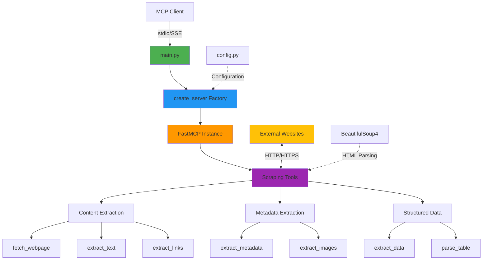

# Lab 04: Web Scraping MCP Server


## Architecture


MCP server for web content extraction and HTML parsing.

## Features

- Fetch webpage content with custom headers
- Extract links with regex filtering
- Extract text with CSS selectors
- Extract metadata (Open Graph, Twitter Cards)
- Extract images with size filtering
- Extract structured data using CSS selectors
- Parse HTML tables

## Installation

```bash
cd 04-web-scraping

# Create virtual environment
python -m venv venv

# Activate virtual environment
# On macOS/Linux:
source venv/bin/activate
# On Windows:
# venv\Scripts\activate

# Install dependencies
pip install -r requirements.txt
```

## Usage

### With MCP Client (Bob)

1. **Navigate to Bob Settings**
   - Open Bob's settings/preferences

2. **Navigate to MCP Servers**
   - Find the MCP Servers section in settings

3. **Open Configuration File**
   - Choose either Local (project-specific) or Global configuration
   - Click to open the configuration file

4. **Add Server Configuration**
   
   **For Local Configuration** (project-specific `.bob/mcp.json`):
   ```json
   {
     "mcpServers": {
       "web-scraper": {
         "command": "/absolute/path/to/example-mcp-servers/04-web-scraping/venv/bin/python",
         "args": ["/absolute/path/to/example-mcp-servers/04-web-scraping/main.py"],
         "env": {
           "SCRAPER_TIMEOUT": "30"
         }
       }
     }
   }
   ```
   
   **For Global Configuration** (`~/Library/Application Support/IBM Bob/User/globalStorage/ibm.bob-code/settings/mcp_settings.json` on macOS):
   ```json
   {
     "mcpServers": {
       "web-scraper": {
         "command": "/absolute/path/to/example-mcp-servers/04-web-scraping/venv/bin/python",
         "args": ["/absolute/path/to/example-mcp-servers/04-web-scraping/main.py"]
       }
     }
   }
   ```
   
   **For Windows users**, use the Windows path format:
   ```json
   {
     "mcpServers": {
       "web-scraper": {
         "command": "C:\\absolute\\path\\to\\example-mcp-servers\\04-web-scraping\\venv\\Scripts\\python.exe",
         "args": ["C:\\absolute\\path\\to\\example-mcp-servers\\04-web-scraping\\main.py"]
       }
     }
   }
   ```
   
   > **Note:** Replace `/absolute/path/to/example-mcp-servers` with the actual path to this repository on your system. The `command` should point to the Python executable inside the virtual environment (`venv/bin/python` on macOS/Linux or `venv\Scripts\python.exe` on Windows) to ensure all dependencies are available.

5. **Restart Bob**
   - Restart Bob to load the new MCP server configuration

6. **Verify Server Status**
   - Check that the MCP server shows a green indicator light
   - The server should appear in Bob's MCP servers list
   
   > **Note:** If you see import errors for `fastmcp` or `starlette` in your editor, this is normal. The server uses the virtual environment where these packages are installed, so as long as the MCP server indicator light is green, everything is working correctly.

### How to Use This Server

Once configured, switch to **Advanced mode** (or any mode with MCP capabilities) and try:

```
"Use the web scraper MCP to fetch the text content from https://example.com"
```

Bob will use the scraping tools to extract and return the webpage content.

### Extra Abilities

This server provides comprehensive web scraping and content extraction capabilities:

- **Content Extraction**: Fetch and parse webpage content with custom headers
  - Example: `"Get the HTML content from https://example.com"`
  - Example: `"Extract just the text from the article paragraphs on https://example.com"`
  - Example: `"Fetch https://httpbin.org/headers and include a custom Authorization header"`

- **Link Extraction**: Find and filter links using regex patterns
  - Example: `"Get all the links from https://example.com"`
  - Example: `"Find all PDF download links on https://example.com"`
  - Example: `"Show me all the external links from https://example.com"`

- **Image Extraction**: Extract images with size filtering or search Openverse
  - Example: `"Find 10 images of 'sunset beach' from Openverse"`
  - Example: `"Search for 'airplane wing' images"`
  - Example: `"Get all images from https://example.com that are at least 300x300 pixels"`
  - Example: `"Extract all product images from https://example.com with their URLs and dimensions"`

- **Metadata Extraction**: Extract Open Graph and Twitter Card metadata
  - Example: `"What's the title, description, and social media preview for https://github.com?"`
  - Example: `"Get the page metadata from https://www.python.org"`
  - Example: `"Show me the Open Graph tags from https://example.com"`

- **Structured Data Extraction**: Use CSS selectors to extract specific elements
  - Example: `"Get all the story titles and links from Hacker News (https://news.ycombinator.com)"`
  - Example: `"Extract the trending repository names and URLs from https://github.com/trending"`
  - Example: `"Pull all the article headlines from https://www.reddit.com/r/programming"`

- **Table Parsing**: Convert HTML tables to structured data
  - Example: `"Extract the population table from https://en.wikipedia.org/wiki/List_of_countries_by_population_(United_Nations)"`
  - Example: `"Get the periodic table data from https://en.wikipedia.org/wiki/Periodic_table"`
  - Example: `"Parse the programming language comparison tables from Wikipedia"`

### Standalone Server (Optional)

```bash
python main.py
```

Server runs with stdio transport for MCP protocol communication.

## Available Tools

### Content Fetching
- `fetch_webpage(url: str, custom_headers: str = "{}")` - Fetch HTML content
- `extract_text(url: str, selector: str = "")` - Extract clean text
- `extract_metadata(url: str)` - Extract page metadata

### Link Extraction
- `extract_links(url: str, filter_pattern: str = "")` - Extract links with regex filter
- `extract_images(url: str, min_width: int = 0, min_height: int = 0)` - Extract images from webpage
- `search_openverse_images(query: str, page_size: int = 5)` - Search for images using Openverse API

### Structured Data
- `extract_structured_data(url: str, selector: str, attributes: str)` - Extract data with CSS selectors
- `extract_tables(url: str, table_index: int = -1)` - Parse HTML tables

## Configuration

Environment variables:
- `SCRAPER_TIMEOUT` - Request timeout in seconds (default: 30)
- `SCRAPER_USER_AGENT` - Custom user agent string

## Testing

```bash
# Server status
curl http://127.0.0.1:8080/

# Health check
curl http://127.0.0.1:8080/health

# Documentation
curl http://127.0.0.1:8080/docs
```

## Project Structure

```
04-web-scraping/
├── main.py              # Entry point
├── scraper_server/
│   ├── __init__.py      # Package exports
│   ├── config.py        # Configuration
│   ├── server.py        # Server factory
│   └── tools/
│       ├── __init__.py  # Tool registration
│       └── scraper.py   # Scraping tools
```

## Key Concepts

- BeautifulSoup for HTML parsing
- CSS selector support
- Regex pattern matching
- Automatic URL resolution
- Custom HTTP headers
- Content size limits

## Security

- Respect robots.txt
- Implement rate limiting in production
- Use descriptive user agents
- Handle authentication securely