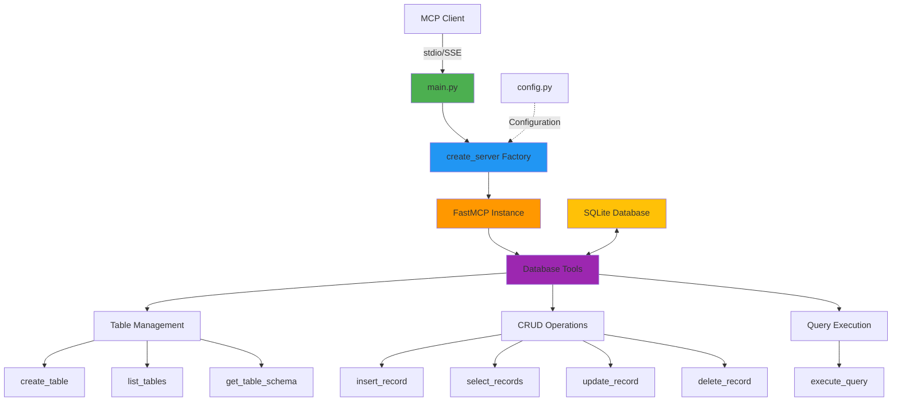

# Lab 05: Database Operations MCP Server

MCP server for SQLite database management with CRUD operations and schema inspection.
## Architecture




## Features

- Table management (create, list, inspect)
- CRUD operations (insert, select, update, delete)
- Custom SQL query execution
- Parameterized queries (SQL injection prevention)
- Schema inspection

## Installation

```bash
cd 05-database-operations

# Create virtual environment
python -m venv venv

# Activate virtual environment
# On macOS/Linux:
source venv/bin/activate
# On Windows:
# venv\Scripts\activate

# Install dependencies
pip install -r requirements.txt

# Create demo database (optional - already included)
python setup_demo.py
```

## Demo Database

This example includes a pre-populated SQLite database (`example.db`) with sample data for immediate testing.

### Included Tables

- **users** - 5 sample users with roles (admin, developer, manager, designer)
- **products** - 8 products across categories (Electronics, Office, Stationery)
- **orders** - 10 orders with various statuses (completed, shipped, processing, pending)
- **tasks** - 7 tasks with priorities and assignments

### Recreate Demo Database

To reset or recreate the database, run the setup script (within your virtual environment):

```bash
python setup_demo.py
```

## Usage

### With MCP Client (Bob)

1. **Navigate to Bob Settings**
   - Open Bob's settings/preferences

2. **Navigate to MCP Servers**
   - Find the MCP Servers section in settings

3. **Open Configuration File**
   - Choose either Local (project-specific) or Global configuration
   - Click to open the configuration file

4. **Add Server Configuration**
   
   **For Local Configuration** (project-specific `.bob/mcp.json`):
   ```json
   {
     "mcpServers": {
       "database-ops": {
         "command": "/absolute/path/to/example-mcp-servers/05-database-operations/venv/bin/python",
         "args": ["/absolute/path/to/example-mcp-servers/05-database-operations/main.py"],
         "env": {
           "DB_PATH": "example.db"
         }
       }
     }
   }
   ```
   
   **For Global Configuration** (`~/Library/Application Support/IBM Bob/User/globalStorage/ibm.bob-code/settings/mcp_settings.json` on macOS):
   ```json
   {
     "mcpServers": {
       "database-ops": {
         "command": "/absolute/path/to/example-mcp-servers/05-database-operations/venv/bin/python",
         "args": ["/absolute/path/to/example-mcp-servers/05-database-operations/main.py"]
       }
     }
   }
   ```
   
   **For Windows users**, use the Windows path format:
   ```json
   {
     "mcpServers": {
       "database-ops": {
         "command": "C:\\absolute\\path\\to\\example-mcp-servers\\05-database-operations\\venv\\Scripts\\python.exe",
         "args": ["C:\\absolute\\path\\to\\example-mcp-servers\\05-database-operations\\main.py"]
       }
     }
   }
   ```
   
   > **Note:** Replace `/absolute/path/to/example-mcp-servers` with the actual path to this repository on your system. The `command` should point to the Python executable inside the virtual environment (`venv/bin/python` on macOS/Linux or `venv\Scripts\python.exe` on Windows) to ensure all dependencies are available.

5. **Restart Bob**
   - Restart Bob to load the new MCP server configuration

6. **Verify Server Status**
   - Check that the MCP server shows a green indicator light
   - The server should appear in Bob's MCP servers list
   
   > **Note:** If you see import errors for `fastmcp` or `starlette` in your editor, this is normal. The server uses the virtual environment where these packages are installed, so as long as the MCP server indicator light is green, everything is working correctly.

### How to Use This Server

Once configured, switch to **Advanced mode** (or any mode with MCP capabilities) and try:

```
"Use the database MCP to show me all users in the database"
```

Bob will query the example database and return the user records.

### Extra Abilities

This server provides comprehensive database management capabilities:

- **Table Management**: Create, list, and inspect table schemas
  - Example: `"Show me all tables in the database"`
  - Example: `"What's the schema for the users table?"`
  - Example: `"Create a new table called 'categories' with id, name, and description columns"`

- **CRUD Operations**: Full create, read, update, delete functionality
  - Example: `"Show me all users in the database"`
  - Example: `"Add a new product called 'Keyboard' with price $79.99 and stock 30"`
  - Example: `"Update the email for user with id 3 to newemail@example.com"`
  - Example: `"Delete all completed tasks"`

- **Advanced Queries**: Complex filtering, joins, aggregations
  - Example: `"Show me all orders with user names and product details"`
  - Example: `"Calculate the total revenue from completed orders"`
  - Example: `"Find products that have never been ordered"`
  - Example: `"List users who have placed more than 2 orders"`

- **Data Analysis**: Insights and reporting
  - Example: `"What's the average price of products by category?"`
  - Example: `"Show me task completion rate by priority"`
  - Example: `"Which user has the most orders?"`
  - Example: `"List all overdue tasks"`

### Standalone Server (Optional)

```bash
python main.py
```

Server runs with stdio transport for MCP protocol communication.

## Available Tools

### Table Management
- `create_table(table_name: str, columns: str)` - Create table with schema
- `list_tables()` - List all tables
- `get_table_schema(table_name: str)` - Get column definitions

### CRUD Operations
- `insert_record(table_name: str, data: str)` - Insert JSON data
- `select_records(table_name: str, where_clause: str = "", limit: int = 100)` - Query records
- `update_records(table_name: str, set_clause: str, where_clause: str)` - Update records
- `delete_records(table_name: str, where_clause: str)` - Delete records

### Advanced
- `execute_custom_query(query: str)` - Execute any SQL query

## Configuration

Environment variables:
- `DB_PATH` - Database file path (default: `example.db`)

## Testing

```bash
# Server status
curl http://127.0.0.1:8080/

# Health check

## Example Tasks for Bob

Once the server is configured in Bob, you can ask the AI agent to perform various database operations. Here are some example prompts:

### Query Operations

```
"Show me all users in the database"
"List all products that cost less than $50"
"Find all orders with status 'pending'"
"Show me tasks assigned to user ID 2"
"What products are low in stock (less than 20 items)?"
```

### Analysis & Reporting

```
"Calculate the total revenue from all completed orders"
"Show me the most expensive products in each category"
"List users who have placed more than one order"
"What's the average price of products in the Electronics category?"
"Show me all high-priority tasks that are not completed"
```

### Data Modification

```
"Update the stock for 'Wireless Mouse' to 45"
"Mark all pending orders as 'processing'"
"Add a new user named 'Frank Miller' with email frank@example.com and role 'developer'"
"Delete all completed tasks from January"
"Change the price of 'Desk Lamp' to $44.99"
```

### Complex Queries

```
"Show me all orders with user names and product names"
"List tasks grouped by status with counts"
"Find products that have never been ordered"
"Show me the top 3 users by total order value"
"List all overdue tasks (due_date before today)"
```

### Schema Operations

```
"Show me the schema for the orders table"
"List all tables in the database"
"Create a new table called 'categories' with columns: id (integer primary key), name (text), description (text)"
"What columns does the products table have?"
```

### Data Insights

```
"Which user has the most tasks assigned?"
"What's the total value of all orders by status?"
"Show me product categories and their average prices"
"List all users who haven't placed any orders"
"What percentage of tasks are completed?"
```

These prompts demonstrate the full range of database operations available through the MCP server. The AI agent will use the appropriate tools to execute queries, modify data, and provide insights.
curl http://127.0.0.1:8080/health

# Documentation
curl http://127.0.0.1:8080/docs
```

## Project Structure

```
05-database-operations/
├── main.py              # Entry point
├── db_server/
│   ├── __init__.py      # Package exports
│   ├── config.py        # Configuration
│   ├── server.py        # Server factory
│   └── tools/
│       ├── __init__.py  # Tool registration
│       └── database.py  # Database tools
```

## Security

- Parameterized queries prevent SQL injection
- Path validation for database files
- Query result limits
- Error handling for invalid operations