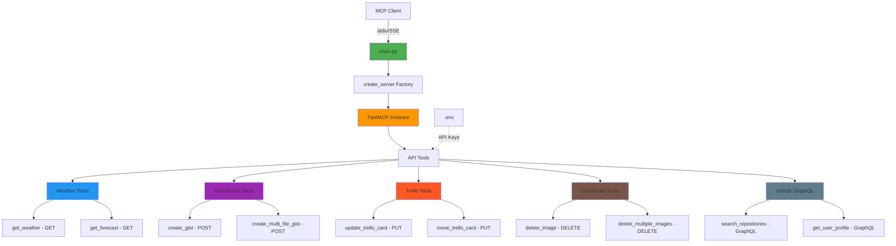

# Lab 06: API Integration MCP Server

MCP server demonstrating HTTP methods and real-world API integrations.

## Architecture



## Features

- **GET** - Weather data ([WeatherAPI.com Free API](https://www.weatherapi.com/signup.aspx))
- **POST** - Create GitHub Gists ([GitHub](https://github.com/settings/tokens))
- **PUT** - Update Trello cards ([Trello](https://trello.com/app-key))
- **DELETE** - Remove Cloudinary images ([Cloudinary](https://cloudinary.com/console))
- **GraphQL** - Query GitHub API ([GitHub](https://github.com/settings/tokens))

## Installation

```bash
cd 06-api-integration

# Create virtual environment
python -m venv venv

# Activate virtual environment
# On macOS/Linux:
source venv/bin/activate
# On Windows:
# venv\Scripts\activate

# Install dependencies
pip install -r requirements.txt
```

## API Key Configuration

This server requires API keys to access external services. Follow these steps:

### 1. Create Your .env File

```bash
# Copy the example file
cp .env.example .env
```

### 2. Get Your API Keys

Open the `.env` file and add your API keys. You can get them from:

- **WeatherAPI.com** (Free): [Sign up here](https://www.weatherapi.com/signup.aspx)
  - After signing up, go to API Keys section to get your key
  - Free tier includes 1,000,000 calls/month

- **GitHub** (Free): [Create token here](https://github.com/settings/tokens)
  - Click "Generate new token (classic)"
  - Select scopes: `gist`, `repo`
  - Copy the token immediately (you won't see it again)

- **Trello** (Optional): [Get API key here](https://trello.com/app-key)
  - Click the link to generate a token
  - Copy both the API key and token

- **Cloudinary** (Optional): [Sign up here](https://cloudinary.com/console)
  - Find credentials in your dashboard
  - Copy Cloud Name, API Key, and API Secret

### 3. Edit Your .env File

Open `.env` in a text editor and replace the placeholder values:

```bash
# Example .env file
WEATHERAPI_KEY=abc123your_actual_key_here
GITHUB_TOKEN=ghp_your_actual_token_here
TRELLO_API_KEY=your_trello_api_key_here
TRELLO_TOKEN=your_trello_token_here
CLOUDINARY_CLOUD_NAME=your_cloud_name_here
CLOUDINARY_API_KEY=your_cloudinary_api_key_here
CLOUDINARY_API_SECRET=your_cloudinary_secret_here
```

> **Note**: The `.env` file is ignored by git and will not be committed.

### 4. Restart the MCP Server

After adding your API keys, restart Bob to reload the MCP server with the new configuration.

## Usage

### With MCP Client (Bob)

1. **Navigate to Bob Settings**
   - Open Bob's settings/preferences

2. **Navigate to MCP Servers**
   - Find the MCP Servers section in settings

3. **Open Configuration File**
   - Choose either Local (project-specific) or Global configuration
   - Click to open the configuration file

4. **Add Server Configuration**
   
   **For Local Configuration** (project-specific `.bob/mcp.json`):
   ```json
   {
     "mcpServers": {
       "api-integration": {
         "command": "/absolute/path/to/example-mcp-servers/06-api-integration/venv/bin/python",
         "args": ["/absolute/path/to/example-mcp-servers/06-api-integration/main.py"]
       }
     }
   }
   ```
   
   **For Global Configuration** (`~/Library/Application Support/IBM Bob/User/globalStorage/ibm.bob-code/settings/mcp_settings.json` on macOS):
   ```json
   {
     "mcpServers": {
       "api-integration": {
         "command": "/absolute/path/to/example-mcp-servers/06-api-integration/venv/bin/python",
         "args": ["/absolute/path/to/example-mcp-servers/06-api-integration/main.py"]
       }
     }
   }
   ```
   
   **For Windows users**, use the Windows path format:
   ```json
   {
     "mcpServers": {
       "api-integration": {
         "command": "C:\\absolute\\path\\to\\example-mcp-servers\\06-api-integration\\venv\\Scripts\\python.exe",
         "args": ["C:\\absolute\\path\\to\\example-mcp-servers\\06-api-integration\\main.py"]
       }
     }
   }
   ```
   
   > **Note:** Replace `/absolute/path/to/example-mcp-servers` with the actual path to this repository on your system. The `command` should point to the Python executable inside the virtual environment (`venv/bin/python` on macOS/Linux or `venv\Scripts\python.exe` on Windows) to ensure all dependencies are available.

5. **Restart Bob**
   - Restart Bob to load the new MCP server configuration

6. **Verify Server Status**
   - Check that the MCP server shows a green indicator light
   - The server should appear in Bob's MCP servers list
   
   > **Note:** If you see import errors for `fastmcp` or `starlette` in your editor, this is normal. The server uses the virtual environment where these packages are installed, so as long as the MCP server indicator light is green, everything is working correctly.

### How to Use This Server

Once configured, switch to **Advanced mode** (or any mode with MCP capabilities) and try:

```
"Use the API integration MCP to get the current weather in New York"
```

Bob will use the weather API tools from this MCP server to fetch the data.

### Extra Abilities

This server provides extensive API integration capabilities:

- **GitHub Gists**: Create single or multi-file gists
  - Example: `"Create a GitHub gist with a Python hello world script"`
  - Example: `"Create a multi-file gist with index.html and styles.css for a simple webpage"`

- **Trello**: Update cards, move between lists, manage labels
  - Example: `"Update the Trello card with ID abc123 to change its name to 'Completed Task'"`
  - Example: `"Move Trello card xyz789 to the 'Done' list"`

- **Cloudinary**: Delete images individually, in bulk, or by prefix
  - Example: `"Delete the Cloudinary image with public_id 'sample_image'"`
  - Example: `"Delete all Cloudinary images with the prefix 'temp_'"`

- **GitHub GraphQL**: Search repositories, get user profiles, query issues with advanced filtering
  - Example: `"Search GitHub for the top 10 Python repositories sorted by stars"`
  - Example: `"Get the GitHub profile for user 'octocat' including their repositories"`
  - Example: `"Show me the open issues for the facebook/react repository"`

### Standalone Server (Optional)

```bash
# Stdio transport (for MCP clients)
python main.py

# SSE transport (standalone)
python main.py --transport sse
```

Server runs with stdio transport for MCP protocol communication.

## API Keys

Get keys from:
- [OpenWeatherMap](https://openweathermap.org/api)
- [GitHub](https://github.com/settings/tokens) - scopes: `gist`, `repo`
- [Trello](https://trello.com/app-key)
- [Cloudinary](https://cloudinary.com/console)

Tools gracefully handle missing keys.

## Available Tools

### Weather (GET)
- `get_weather(city: str)`
- `get_forecast(city: str, days: int = 5)`

### GitHub Gists (POST)
- `create_gist(description: str, filename: str, content: str, public: bool = True)`
- `create_multi_file_gist(description: str, files: list, public: bool = True)`

### Trello (PUT)
- `update_trello_card(card_id: str, name: str = None, ...)`
- `move_trello_card(card_id: str, list_id: str)`
- `update_trello_card_labels(card_id: str, label_ids: list)`

### Cloudinary (DELETE)
- `delete_image(public_id: str, resource_type: str = "image")`
- `delete_multiple_images(public_ids: list, resource_type: str = "image")`
- `delete_images_by_prefix(prefix: str, resource_type: str = "image")`

### GitHub GraphQL
- `search_github_repositories(query: str, limit: int = 10, sort: str = "STARS")`
- `get_github_user_profile(username: str, include_repos: bool = True)`
- `get_github_repository_issues(owner: str, repo: str, state: str = "OPEN", limit: int = 10)`

## Project Structure

```
06-api-integration/
├── main.py
├── .env.example
├── api_server/
│   ├── __init__.py
│   ├── config.py
│   ├── server.py
│   └── tools/
│       ├── weather.py       # GET requests
│       ├── gist.py          # POST requests
│       ├── trello.py        # PUT requests
│       ├── storage.py       # DELETE requests
│       └── github_graphql.py # GraphQL queries
```

## Key Concepts

- Authentication patterns (API keys, Bearer tokens)
- Async/await with httpx
- Error handling
- Environment variables
- REST vs GraphQL

## Testing

```bash
# Server info
curl http://127.0.0.1:8000/

# Health check
curl http://127.0.0.1:8000/health