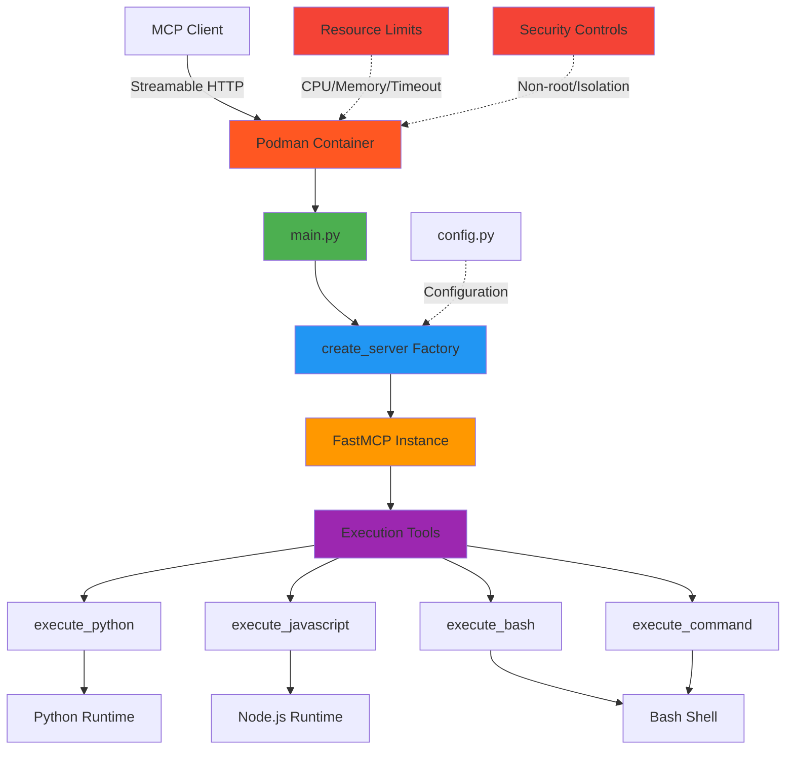

# Code Execution Sandbox MCP Server

Containerized MCP server for safe code execution. Demonstrates why containers are required for security-critical operations.

## Architecture



## Why Containers Required

Unlike servers 01-06, this server **must** run in a container because:

- **Security** - Executes untrusted user code
- **Isolation** - Prevents system access
- **Resources** - Enforces CPU/memory limits
- **Multi-runtime** - Bundles Python, Node.js, Bash

## Features

- Execute Python, JavaScript, Bash code
- Resource limits (CPU, memory, timeout)
- Non-root execution
- Output size limits
- Isolated filesystem

## Prerequisites

- Podman

## Podman Setup

If you don't have Podman installed, set it up first:

```bash
# Install Podman (macOS)
brew install podman

# Initialize Podman machine
podman machine init

# Start Podman machine
podman machine start

# Verify installation
podman info
```

> **Note:** Podman runs containers in a lightweight VM on macOS. The machine needs to be running before you can build or run containers.

## Installation

Build and run the container:

```bash
cd 07-code-sandbox

# Build the container image
podman build -t code-sandbox-mcp .

# Run the container with security settings
podman run -d \
  --name code-sandbox-mcp \
  -p 8080:8080 \
  --memory=256m \
  --cpus=1.0 \
  --read-only \
  --tmpfs /tmp \
  --tmpfs /sandbox:mode=1777 \
  --security-opt no-new-privileges:true \
  -e SANDBOX_TIMEOUT=30 \
  -e SANDBOX_MAX_OUTPUT=1048576 \
  code-sandbox-mcp

# Verify the server is running
curl http://localhost:8080/health
```

## Usage

### With MCP Client (Bob)

1. **Navigate to Bob Settings**
   - Open Bob's settings/preferences

2. **Navigate to MCP Servers**
   - Find the MCP Servers section in settings

3. **Open Configuration File**
   - Choose either Local (project-specific) or Global configuration
   - Click to open the configuration file

4. **Add Server Configuration**
   
   **For Local Configuration** (project-specific `.bob/mcp.json`):
   ```json
   {
     "mcpServers": {
       "code-sandbox": {
         "type": "streamable-http",
         "url": "http://localhost:8080/mcp/"
       }
     }
   }
   ```
   
   **For Global Configuration** (`~/Library/Application Support/IBM Bob/User/globalStorage/ibm.bob-code/settings/mcp_settings.json` on macOS):
   ```json
   {
     "mcpServers": {
       "code-sandbox": {
         "type": "streamable-http",
         "url": "http://localhost:8080/mcp/"
       }
     }
   }
   ```
   
   > **Note:** This server runs in a Podman container for security, with resource limits (256MB RAM, 1 CPU).

5. **Restart Bob**
   - Restart Bob to load the new MCP server configuration

6. **Verify Server Status**
   - Check that the MCP server shows a green indicator light
   - The server should appear in Bob's MCP servers list
   
   > **Note:** If you see import errors for `fastmcp` or `starlette` in your editor, this is normal. The server uses the virtual environment where these packages are installed, so as long as the MCP server indicator light is green, everything is working correctly.

### How to Use This Server

Once configured, switch to **Advanced mode** (or any mode with MCP capabilities) and try:

```
"Use the code sandbox MCP to execute this Python code: print('Hello from sandbox!')"
```

Bob will safely execute the code in an isolated container and return the output.

### Extra Abilities

This server provides secure multi-language code execution:
- **Python Execution**: Run Python scripts with standard library access
- **JavaScript/Node.js**: Execute JavaScript code with Node.js runtime
- **Bash Scripts**: Run shell scripts and commands
- **Resource Limits**: Automatic timeout and memory constraints for safety
- **Stdin Support**: Pass input to executing programs

### Standalone Container (Optional)

For testing the container directly:

```bash
# Build the container image
podman build -t code-sandbox-mcp .

# Run the container with streamable HTTP support
podman run -d \
  --name code-sandbox-mcp \
  -p 8080:8080 \
  --memory=256m \
  --cpus=1.0 \
  --read-only \
  --tmpfs /tmp \
  --tmpfs /sandbox:mode=1777 \
  --security-opt no-new-privileges:true \
  -e SANDBOX_TIMEOUT=30 \
  -e SANDBOX_MAX_OUTPUT=1048576 \
  code-sandbox-mcp
```

The server will be available at `http://localhost:8080` with streamable HTTP transport enabled.

> **Note:** This server uses streamable HTTP transport for better compatibility and reliability with MCP clients.

## Available Tools

- `execute_python(code: str, stdin: str = "")` - Execute Python code
- `execute_javascript(code: str, stdin: str = "")` - Execute Node.js code
- `execute_bash(script: str, stdin: str = "")` - Execute Bash scripts
- `execute_command(command: str, args: str = "")` - Execute shell commands

## Configuration

Environment variables:
- `SANDBOX_TIMEOUT` - Execution timeout in seconds (default: 30)
- `SANDBOX_MAX_OUTPUT` - Maximum output size in bytes (default: 1048576)

## Testing

```bash
# Check container
podman ps | grep code-sandbox

# Server health
curl http://localhost:8080/health

# Documentation
curl http://localhost:8080/docs
```

## Project Structure

```
07-code-sandbox/
├── Dockerfile              # Container definition
├── main.py                 # Entry point
├── requirements.txt        # Dependencies
└── sandbox_server/
    ├── config.py          # Configuration
    ├── server.py          # Server factory
    └── tools/
        └── executor.py    # Execution tools
```

## Security Features

- Non-root user execution
- Resource limits (256MB RAM, 1 CPU)
- Timeout protection (30s default)
- Output size limits (1MB)
- Read-only filesystem
- Isolated environment

## Container vs Direct Execution

| Aspect | Direct | Container |
|--------|--------|-----------|
| Security | ❌ Host access | ✅ Isolated |
| Resources | ❌ Unlimited | ✅ Limited |
| Dependencies | ❌ Manual install | ✅ Bundled |
| Cleanup | ❌ Manual | ✅ Automatic |

## Made with Bob

Demonstrates containerization for security-critical MCP servers.