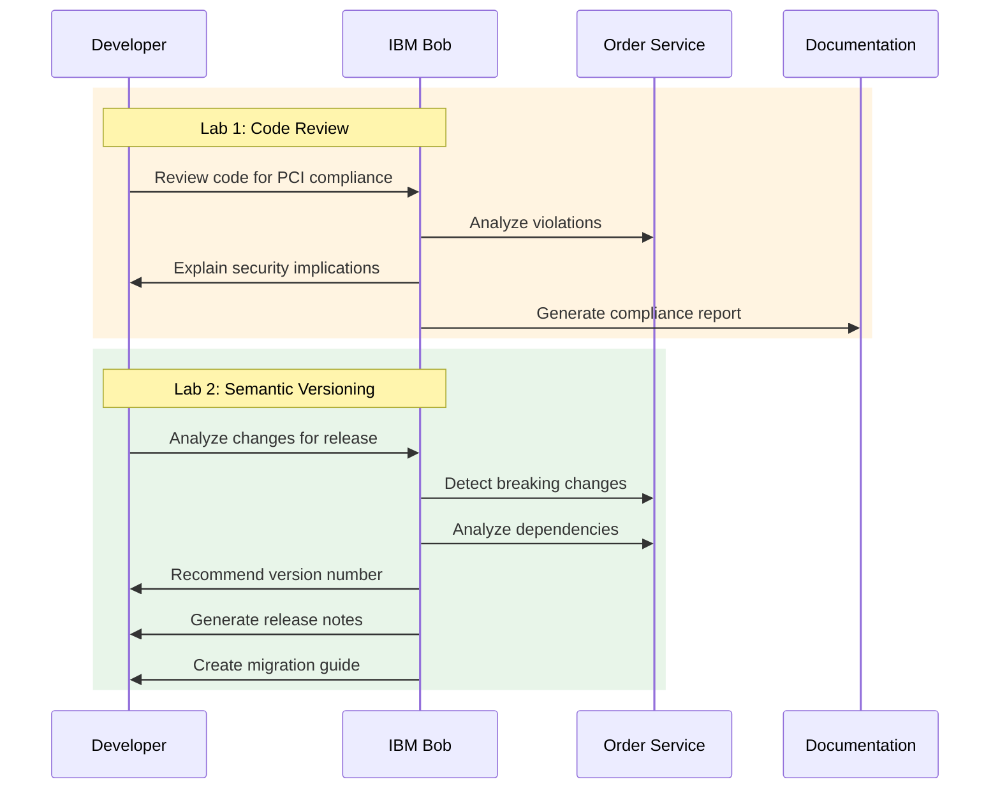

# Application Development Labs

**AI-Assisted Application Development for Financial Services**

Hands-on labs demonstrating how IBM Bob integrates into application development workflows for regulated environments. Experience Bob as an always-on copilot that removes mental tax from code review, semantic versioning, and release engineering.

---

## Tech Stack

- **Application**: Spring Boot 3.2, PostgreSQL 15, Maven
- **Language**: Java 17
- **Standards**: PCI DSS coding standards, Semantic Versioning
- **AI**: IBM Bob for analysis and automation

---

## What These Labs Demonstrate

These labs teach you to use IBM Bob as a quality-of-life improvement for experienced application development teams. By the end, you'll have:

**Core Labs:**
1. **Lab 1: Code Review** → Bob analyzes code quality, enforces PCI compliance, generates reports
2. **Lab 2: Semantic Versioning** → Bob acts as release engineer, detects breaking changes, recommends versions

### Real-World Use Cases

- **Code Quality**: Bob identifies PCI violations and explains security implications
- **Breaking Change Detection**: Bob catches behavioral changes invisible at the API level
- **Dependency Analysis**: Bob explains third-party upgrade impact on consumers
- **Version Decisions**: Bob recommends correct semantic version increments with rationale
- **Release Communication**: Bob generates release notes and migration guides

---

## Architecture

```mermaid
graph TB
    Dev[Developer] -->|Write code| Code[Order Service]
    
    Dev -->|Ask Bob| Bob[IBM Bob]
    
    Bob -->|Lab 1| Review[Code Review]
    Bob -->|Lab 2| Version[Semantic Versioning]
    
    Review -->|Analyze| PCI[PCI Compliance]
    Review -->|Generate| Reports[Wiki Reports]
    
    Version -->|Detect| Breaking[Breaking Changes]
    Version -->|Analyze| Deps[Dependencies]
    Version -->|Recommend| SemVer[Version Numbers]
    Version -->|Generate| ReleaseNotes[Release Notes]
    
    Code -->|Deploy| Prod[Production]
    
    style Bob fill:#e1f5ff
    style Review fill:#fff4e1
    style Version fill:#e8f5e9
```



---

## Lab Flow



---

## Key Features

### 🔍 Lab 1: Code Review with Bob
- **PCI Compliance**: Bob enforces 6 PCI DSS coding standards
- **Security Analysis**: Bob explains why violations matter
- **Automated Reports**: Bob generates markdown reports for wiki publishing
- **Remediation Guidance**: Bob provides specific fix suggestions

**PCI Standards Covered:**
- PCI-01: No System.out/err (prevents PII leakage)
- PCI-02: No hardcoded credentials
- PCI-03: No hardcoded IP addresses
- PCI-04: No printStackTrace() (information disclosure)
- PCI-05: No weak Random (use SecureRandom)
- PCI-06: No TODO/FIXME in production code

### 📦 Lab 2: Semantic Versioning with Bob
- **Breaking Change Detection**: Bob catches behavioral changes beyond API signatures
- **Dependency Analysis**: Bob explains third-party upgrade impact
- **Version Recommendations**: Bob suggests MAJOR/MINOR/PATCH with rationale
- **Release Communication**: Bob generates release notes and migration guides

**What Bob Detects:**
- API signature changes (obvious)
- Behavioral changes (subtle)
- Dependency-driven breaking changes (hidden)
- Consumer impact analysis (critical)

---

## Project Structure

```
labs/app_labs/
├── lab1/                          # Code Review Lab
│   ├── LAB1_CODE_REVIEW.md       # Complete lab guide
│   ├── inject-pci-violations.sh   # Practice violations
│   └── restore-pci-violations.sh  # Cleanup script
│
├── lab2.3/                        # Semantic Versioning Lab (Quick)
│   ├── LAB2.3_SEMANTIC_VERSIONING.md  # Complete lab guide (60-90 min)
│   ├── QUICK_START.md             # Condensed reference
│   └── README.md                  # Lab overview
│
├── lab2.2/                        # Semantic Versioning Lab (Comprehensive)
│   ├── LAB2.2_SEMANTIC_VERSIONING.md  # Detailed lab (3-4 hours)
│   ├── QUICK_START.md             # Reference guide
│   └── README.md                  # Lab overview
│
└── README.md                      # This file
```

---

## Learning Path

### Quick Path (2-3 hours)
1. **Lab 1: Code Review** (~60 minutes)
   - Learn Bob's Code Reviewer mode
   - Practice PCI compliance analysis
   - Generate automated reports

2. **Lab 2.3: Semantic Versioning** (~60-90 minutes)
   - Experience Bob as release engineer
   - Detect breaking changes
   - Make version decisions with confidence

### Comprehensive Path (5-6 hours)
1. **Lab 1: Code Review** (~60 minutes)
2. **Lab 2.2: Semantic Versioning** (~3-4 hours)
   - Deep dive into semantic versioning
   - Extensive examples and troubleshooting
   - Advanced dependency analysis

---

## Lab Comparison

### Lab 1: Code Review
- **Time:** 60 minutes
- **Difficulty:** Beginner
- **Focus:** Code quality and PCI compliance
- **Mode:** Code Reviewer mode
- **Output:** Compliance reports, remediation guidance

### Lab 2.3: Semantic Versioning (Quick)
- **Time:** 60-90 minutes
- **Difficulty:** Intermediate
- **Focus:** Release engineering and version decisions
- **Mode:** Advanced mode
- **Output:** Version recommendations, release notes, migration guides

### Lab 2.2: Semantic Versioning (Comprehensive)
- **Time:** 3-4 hours
- **Difficulty:** Intermediate to Advanced
- **Focus:** Deep understanding of semantic versioning
- **Mode:** Advanced mode
- **Output:** Detailed analysis, extensive documentation

---

## Prerequisites

### For All Labs
- Access to order-service repository
- Basic understanding of Java and Spring Boot
- Familiarity with Git

### Lab-Specific
- **Lab 1**: Understanding of coding standards
- **Lab 2**: Understanding of semantic versioning concepts

---

## Getting Started

### Step 1: Choose Your Lab

**New to Bob?** Start with Lab 1 to learn code review basics.

**Experienced with Bob?** Jump to Lab 2.3 for semantic versioning.

**Want deep understanding?** Complete Lab 1, then Lab 2.2.

### Step 2: Navigate to Lab Directory

```bash
cd labs/app_labs/lab1    # For code review
cd labs/app_labs/lab2.3  # For semantic versioning (quick)
cd labs/app_labs/lab2.2  # For semantic versioning (comprehensive)
```

### Step 3: Follow Lab Instructions

Each lab has a complete guide with step-by-step instructions and Bob prompts.

---

## What You'll Learn

### Lab 1: Code Review
- How to use Bob's Code Reviewer mode
- PCI DSS coding standards and security implications
- Automated report generation for documentation
- Remediation strategies for common violations

### Lab 2: Semantic Versioning
- How Bob acts as an always-on release engineer
- Detecting breaking changes beyond API signatures
- Analyzing third-party dependency impact
- Making confident version decisions
- Generating release communications

---

## Quality-of-Life Impact

### Without Bob
- ⏱️ Hours of manual code review
- 🧠 Tribal knowledge about standards
- 📅 Meetings to discuss versions
- 🚨 Post-release incidents
- 🐌 Slow, cautious releases

### With Bob
- ⚡ Automated analysis
- 🎯 Instant compliance checks
- ✅ Confident decisions
- 🛡️ Proactive prevention
- 🚀 Fast, safe releases

---

## Target Audience

These labs are designed for **experienced application development teams** who:
- Maintain backend services or APIs
- Work in regulated environments (financial services, healthcare)
- Ship shared libraries or internal platforms
- Regularly upgrade dependencies
- Are accountable for production stability

---

## Success Criteria

You've successfully completed these labs when you can:

**Lab 1:**
- ✅ Use Bob to identify PCI violations
- ✅ Understand security implications of violations
- ✅ Generate automated compliance reports
- ✅ Apply remediation with confidence

**Lab 2:**
- ✅ Detect breaking changes beyond API signatures
- ✅ Analyze dependency-driven failures
- ✅ Justify version increments with confidence
- ✅ Generate release communications
- ✅ Understand how Bob prevents production incidents

---

## Next Steps After Completion

1. **Apply to Your Service**: Use Bob for your next code review or release
2. **Integrate into Workflow**: Add Bob to your development process
3. **Share with Team**: Demonstrate Bob's value to colleagues
4. **Explore Advanced Labs**: Check out optional labs in `labs/optional/`

---

## Related Labs

- **[LAB_BOB_PIPELINE.md](../LAB_BOB_PIPELINE.md)** — Integrate Bob into Jenkins CI/CD pipeline
- **[LAB3_SECURITY_ANALYSIS.md](../lab3/LAB3_SECURITY_ANALYSIS.md)** — Security vulnerability analysis
- **[LAB4_MODE.md](../optional/LAB4_MODE.md)** — Create custom Bob modes
- **[LAB5_SKILLS.md](../optional/LAB5_SKILLS.md)** — Build Bob skills

---

## Support

For questions or issues:
- Review the troubleshooting section in each lab
- Check the Quick Start guides for common prompts
- Refer to comprehensive labs for detailed explanations

---

## Key Takeaway

> **IBM Bob removes the mental tax of application development**, allowing experienced teams to move faster with confidence while maintaining quality and compliance.

These labs demonstrate how Bob acts as an always-on copilot for:
- Code quality and compliance
- Release engineering and versioning
- Risk assessment and prevention
- Documentation and communication

---

**Lab Collection Version:** 1.0  
**Last Updated:** 2026-05-05  
**Total Time:** 2-6 hours (depending on path chosen)