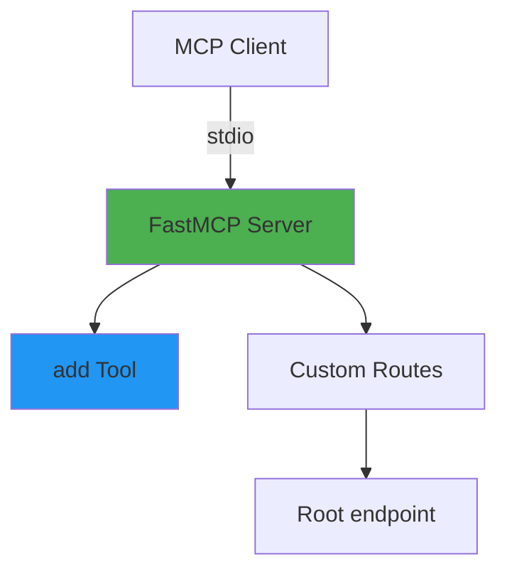

# Simple Calculator MCP Server

Minimal single-file MCP server implementation demonstrating core concepts.

## Architecture



### Features

- Single-file architecture
- Basic calculator tool
- stdio transport
- Custom HTTP routes

### Available Tools

- `add(a: int, b: int) -> int` - Add two numbers

### Code Structure

Single file containing:

- Server initialization
- Tool definitions
- Custom routes
- Logging configuration

## Installation

```bash
cd 01-simple-calculator

# Create virtual environment with uv
uv venv

# Activate virtual environment
# On macOS/Linux:
source .venv/bin/activate
# On Windows:
# .venv\Scripts\activate

# Install dependencies
uv pip install -r requirements.txt
```

## Usage

### Configure MCP Server in Bob

1. **Navigate to Bob Settings**
   - Open Bob's settings/preferences

2. **Navigate to MCP Servers**
   - Find the MCP Servers section in settings

3. **Open Configuration File**
   - Click to open the Local (project-specific) configuration file

4. **Add Server Configuration**
   - Add the following configuration to the `.bob/mcp.json` file:

   ```json
   {
     "mcpServers": {
       "simple-calculator": {
         "command": "/absolute/path/to/example-mcp-servers/01-simple-calculator/.venv/bin/python",
         "args": ["/absolute/path/to/example-mcp-servers/01-simple-calculator/server.py"]
       }
     }
   }
   ```

   **For Windows users**, use the Windows path format:

   ```json
   {
     "mcpServers": {
       "simple-calculator": {
         "command": "C:\\absolute\\path\\to\\example-mcp-servers\\01-simple-calculator\\.venv\\Scripts\\python.exe",
         "args": ["C:\\absolute\\path\\to\\example-mcp-servers\\01-simple-calculator\\server.py"]
       }
     }
   }
   ```
  
   > **Note:** Replace `/absolute/path/to/example-mcp-servers` with the actual path to this repository on your system. The `command` should point to the Python executable inside the virtual environment (`.venv/bin/python` on macOS/Linux or `.venv\Scripts\python.exe` on Windows) to ensure all dependencies are available.

5. **Verify Server Status**
   - Check that the MCP server shows a green indicator light
   - Click on the `simple-calculator` server in Bob's MCP servers list and click the **Restart server** icon.

   > **Note:** If you see import errors for `fastmcp` or `starlette` in your editor, this is normal. The server uses the virtual environment where these packages are installed, so as long as the MCP server indicator light is green, everything is working correctly.

### How to Use This Server

Once configured, switch to **Advanced mode** (or any mode with MCP capabilities) and try:

```text
"Use the calculator MCP to add 8 and 8 together"
```

Bob will use the `add` tool from this MCP server to perform the calculation.

## Cleanup

When you're done with this lab and want to clean up:

1. Deactivate Virtual Environment

  ```bash
  # Deactivate the virtual environment
  deactivate
  ```

1. Remove MCP Server Configuration

    - Open `.bob/mcp.json` and remove the `simple-calculator` server entry:

1. [Optionally] Remove the virtual environment if you want to free up disk space:

    ```bash
    # From the lab directory
    rm -rf .venv
    ```
