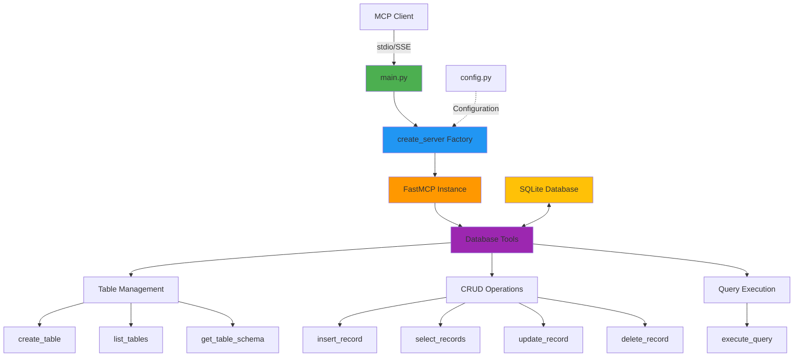

# Database Operations MCP Server

MCP server for SQLite database management with CRUD operations and schema inspection.

## Architecture



### Project Structure

```text
05-database-operations/
├── main.py              # Entry point
├── db_server/
│   ├── __init__.py      # Package exports
│   ├── config.py        # Configuration
│   ├── server.py        # Server factory
│   └── tools/
│       ├── __init__.py  # Tool registration
│       └── database.py  # Database tools
```

### Features

- Table management (create, list, inspect)
- CRUD operations (insert, select, update, delete)
- Custom SQL query execution
- Parameterized queries (SQL injection prevention)
- Schema inspection

### Available Tools

- **Table Management**
  - `create_table(table_name: str, columns: str)` - Create table with schema
  - `list_tables()` - List all tables
  - `get_table_schema(table_name: str)` - Get column definitions

- **CRUD Operations**
  - `insert_record(table_name: str, data: str)` - Insert JSON data
  - `select_records(table_name: str, where_clause: str = "", limit: int = 100)` - Query records
  - `update_records(table_name: str, set_clause: str, where_clause: str)` - Update records
  - `delete_records(table_name: str, where_clause: str)` - Delete records

- **Advanced**
  - `execute_custom_query(query: str)` - Execute any SQL query

### Security

- Parameterized queries prevent SQL injection
- Path validation for database files
- Query result limits
- Error handling for invalid operations

## Installation

```bash
cd 04-database-operations

# Create virtual environment with uv
uv venv

# Activate virtual environment
# On macOS/Linux:
source .venv/bin/activate
# On Windows:
# .venv\Scripts\activate

# Install dependencies
uv pip install -r requirements.txt

# Create demo database (optional - already included)
python setup_demo.py
```

## Demo Database

This example includes a pre-populated SQLite database (`example.db`) with sample data for immediate testing.

### Configuration

You can set the following vnvironment variables:

- `DB_PATH` - Database file path (default: `example.db`)

### Included Tables

- **users** - 5 sample users with roles (admin, developer, manager, designer)
- **products** - 8 products across categories (Electronics, Office, Stationery)
- **orders** - 10 orders with various statuses (completed, shipped, processing, pending)
- **tasks** - 7 tasks with priorities and assignments

## Usage

### Configure MCP Client in Bob

1. **Navigate to Bob Settings**
   - Open Bob's settings/preferences

2. **Navigate to MCP Servers**
   - Find the MCP Servers section in settings

3. **Open Configuration File**
   - Click to open the Local (project-specific) configuration file

4. **Add Server Configuration**
   - Add the following configuration to the `.bob/mcp.json` file:

   ```json
   {
     "mcpServers": {
       "database-ops": {
         "command": "/absolute/path/to/example-mcp-servers/04-database-operations/.venv/bin/python",
         "args": ["/absolute/path/to/example-mcp-servers/04-database-operations/main.py"],
         "env": {
           "DB_PATH": "example.db"
         }
       }
     }
   }
   ```

   **For Windows users**, use the Windows path format:

   ```json
   {
     "mcpServers": {
       "database-ops": {
         "command": "C:\\absolute\\path\\to\\example-mcp-servers\\04-database-operations\\.venv\\Scripts\\python.exe",
         "args": ["C:\\absolute\\path\\to\\example-mcp-servers\\04-database-operations\\main.py"]
       }
     }
   }
   ```

   > **Note:** Replace `/absolute/path/to/example-mcp-servers` with the actual path to this repository on your system. The `command` should point to the Python executable inside the virtual environment (`.venv/bin/python` on macOS/Linux or `.venv\Scripts\python.exe` on Windows) to ensure all dependencies are available.

5. **Verify Server Status**
    - Check that the MCP server shows a green indicator light
    - Click on the `database-ops` server in Bob's MCP servers list and click the **Restart server** icon.

   > **Note:** If you see import errors for `fastmcp` or `starlette` in your editor, this is normal. The server uses the virtual environment where these packages are installed, so as long as the MCP server indicator light is green, everything is working correctly.

### How to Use This Server

Once configured, switch to **Advanced mode** (or any mode with MCP capabilities) and try:

```text
"Use the database MCP to show me all users in the database"
```

Bob will query the example database and return the user records.

### Extra Abilities

Once the server is configured in Bob, you can ask the AI agent to perform various database operations. Here are some example prompts:

- **Table Management**: Create, list, and inspect table schemas
  - Example: `"Show me all tables in the database"`
  - Example: `"What's the schema for the users table?"`
  - Example: `"Create a new table called 'categories' with id, name, and description columns"`
  - Example: `"What columns does the products table have?"`

- **CRUD Operations**: Full create, read, update, delete functionality
  - Example: `"Show me all users in the database"`
  - Example: `"Add a new product called 'Keyboard' with price $79.99 and stock 30"`
  - Example: `"Update the email for user with id 3 to newemail@example.com"`
  - Example: `"Delete all completed tasks"`

- **Advanced Queries**: Complex filtering, joins, aggregations
  - Example: `"Show me all orders with user names and product details"`
  - Example: `"Calculate the total revenue from completed orders"`
  - Example: `"Find products that have never been ordered"`
  - Example: `"List users who have placed more than 2 orders"`

- **Data Analysis**: Insights and reporting
  - Example: `"What's the average price of products by category?"`
  - Example: `"Show me task completion rate by priority"`
  - Example: `"Which user has the most orders?"`
  - Example: `"List all overdue tasks"`
  - Example: `"Show me the most expensive products in each category"`
  - Example: `"What's the average price of products in the Electronics category?"`
  - Example: `"Show me the top 3 users by total order value"`

These prompts demonstrate the full range of database operations available through the MCP server. The AI agent will use the appropriate tools to execute queries, modify data, and provide insights.

## Cleanup

### Recreate Demo Database

To reset or recreate the database, run the setup script (within your virtual environment):

```bash
python setup_demo.py
```

### Reset the environment

When you're done with this lab and want to clean up:

1. Deactivate Virtual Environment

  ```bash
  # Deactivate the virtual environment
  deactivate
  ```

1. Remove MCP Server Configuration

    - Open `.bob/mcp.json` and remove the `database-ops` server entry:

1. [Optionally] Remove the virtual environment if you want to free up disk space:

    ```bash
    # From the lab directory
    rm -rf .venv
    ```
