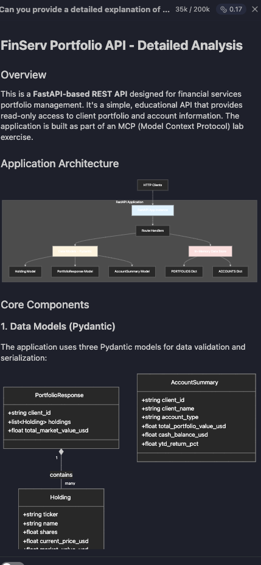
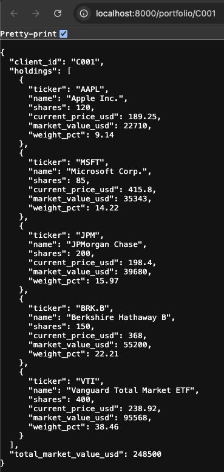

# Wrapping and Converting an API with MCP

---

## Overview

In this lab, you will work with a simple financial services API built in Python and use **IBM Bob** as your AI development partner to:

1. **Wrap** the existing API with an MCP server (non-invasive — the API keeps running as-is)
2. **Convert** the API into a native MCP server using `fastmcp` (the API is replaced )

By the end, you will understand the tradeoffs between both approaches and have hands-on experience letting Bob guide and generate the MCP implementation for you.

---

### Prerequisites

| Tool | Version | Notes |
|------|---------|-------|
| Python | 3.11+ | |
| [uv](https://docs.astral.sh/uv/) | latest | Fast Python package manager |

---

### Project Structure

The project has been scaffolded for you as follows:

```text
05-api-to-mcp/
├── README.md           # This lab guide
├── pyproject.toml      # Project dependencies
├── api/
│   ├── __init__.py
│   └── main.py         # FastAPI application (already created)
├── mcp_wrapper/
│   ├── __init__.py
│   └── server.py       # You'll create this in Part 1
└── mcp_native/
    ├── __init__.py
    └── server.py       # You'll create this in Part 2
```

### Lab Structure

```text
Part 0 — Setup and explore the API
Part 1 — Wrap the API with an MCP Server
Part 2 — Convert the API to a Native MCP Server
Part 3 — Compare and Reflect
```

---

## Part 0: Project Setup and As-is Exploration

Before you go about wrapping the API with an MCP server, you should explore the API and understand how it works. For the purposes of this lab, we have a minimal portfolio management API for a fictional wealth management firm. It exposes two operations:

| Endpoint | Method | Description |
|----------|--------|-------------|
| `/portfolio/{client_id}` | GET | Returns the client's investment holdings |
| `/account/{client_id}/summary` | GET | Returns the client's account summary |

All data is hardcoded — no database needed. This is a rather simple API, but it will do for the purposes of this lab.

1. Lets create the python environment

    ```bash
    cd labs/handoff-labs/bob-mcp-labs/05-api-to-mcp
    ```

1. Using `uv`, create and activate a virtual environment (run these command individually):

    ```bash
    # Create virtual environment
    uv venv

    # Activate it (macOS/Linux)
    source .venv/bin/activate

    # Activate it (Windows)
    .venv\Scripts\activate
    ```

1. Install the project dependencies
    - `fastapi` - Web framework for the API
    - `httpx` - HTTP client for the MCP wrapper
    - `fastmcp` - Framework for building MCP servers

    ```bash
    uv pip install -r requirements.txt
    ```

1. Open `api/main.py` and review the code. Notice:

    - **Pydantic models** for type-safe responses (`Holding`, `PortfolioResponse`, `AccountSummary`)
    - **Hardcoded data** for two clients: `C001` (Margaret Holloway) and `C002` (David Tran)
    - **Three endpoints**: `/health`, `/portfolio/{client_id}`, `/account/{client_id}/summary`

1. Note that the API includes realistic financial data:
    - Stock holdings (AAPL, MSFT, JPM, BRK.B)
    - ETF holdings (VTI, VXUS, BND, GLD)
    - Portfolio values, weights, and account summaries

1. Lets go ahead ask Bob to help us understand the application. Switch to the **`Ask`** mode in Bob, then ask Bob to explain the application.

    ```text
    Can you provide a detailed explanation of the application in @05-api-to-mcp/api . Include mermaid diagrams to help me understand the application components, data flows and the API interfaces.
    ```

1. Bob will give you a fairly comprehensive explanation of the application. He will help you understand the application components, data flows, API interfaces, technology stack, and the overall application architecture.

    

Next, lets run the API's to see how they work.

1. FastAPI includes a built-in development server. From the `05-api-to-mcp` directory:

    ```bash
    fastapi dev api/main.py
    ```

1. You should see:

    ```text
    INFO:     Uvicorn running on http://127.0.0.1:8000 (Press CTRL+C to quit)
    INFO:     Started reloader process ...
    ```

    > **Note:** `fastapi dev` automatically enables hot-reload, so any changes to your code will restart the server.

1. Test that the APIs are responding:

    - [Option 1] Open a **second terminal** (keep the server running in the first), activate the virtual environment, and test:

        ```bash
        # Activate virtual environment
        source .venv/bin/activate  # or .venv\Scripts\activate on Windows

        # Health check
        curl http://localhost:8000/health

        # Portfolio for client C001
        curl http://localhost:8000/portfolio/C001

        # Account summary for client C002
        curl http://localhost:8000/account/C002/summary
        ```

    - [Option 2] Open a browser and visit the links shown above.

        

---

## Part 1: Wrap the API with an MCP Server

In this first approach, you **leave the FastAPI app completely untouched**. You build a new MCP server alongside it that proxies calls to the running HTTP API.

**When to use this approach:**

- You don't own or cannot modify the existing API
- The API is consumed by other non-MCP clients and must stay as HTTP
- You want to add MCP as a new interface without any migration risk

```text
MCP Client (Bob)
         ↓
   MCP Wrapper Server      ← what you build in this track
         ↓  (HTTP)
   FastAPI App             ← unchanged, still running on :8000
         ↓
   Hardcoded data
```

### Plan the wrapper implementation

A good practice when using AI partners in the SDLC process is to start with understanding and planning before jumping straight to implementation. So we will start by asking Bob to design the wrapper.

1. Make sure your FastAPI server is still running on port 8000. Start a new task, and ensure Bob is in **Plan mode** and enter the following prompt:

    ```text
    I have a running FastAPI app at http://localhost:8000 with two endpoints:
    - GET /portfolio/{client_id}
    - GET /account/{client_id}/summary

    I want to wrap this API with an MCP server using the fastmcp library.
    The MCP server should expose these endpoints as MCP tools so that an AI agent can call them using natural language.

    The MCP server will make HTTP calls to the FastAPI app using httpx.
    The FastAPI app keeps running unchanged.

    Show me a plan for mcp_wrapper/server.py before writing any code.
    ```

1. Review the plan, essentially we are going to create an MCP server with two tools to mirror the two API endpoints.

1. Feel free to tweak the plan if you think it's needed.

### Implement and Test the MCP Server Wrapper

1. Lets use Bob to implement this plan. Switch to **Code mode** and enter the following prompt:

    ```text
    Go ahead and implement the MCP wrapper server in mcp_wrapper/server.py based on the plan.
    Use fastmcp and httpx.
    Each MCP tool should have a clear docstring that describes what it does, what the client_id parameter means, and what the tool returns.
    The base URL for the FastAPI app should be a configurable constant at the top of the file.
    Handle HTTP errors gracefully and raise meaningful exceptions.
    ```

1. Bob should have created the MCP server in `mcp_wrapper/server.py` and added the two tools.

1. Open Bob Settings (click the gear icon in the Bob panel) and navigate to the MCP Servers section

1. Click "Open", next to the `Project MCPs` section and add our new MCP server:

   ```json
   {
     "mcpServers": {
       "finserv-portfolio-wrapper": {
         "command": "uv",
         "args": [
            "run",
            "python",
            "mcp_wrapper/server.py"
        ],
        "cwd": "${workspaceFolder}/labs/handoff-labs/bob-mcp-labs/05-api-to-mcp"
       }
     }
   }

1. **Verify Server Status**

    - Check that the MCP server shows a green indicator light
    - Click on the `finserv-portfolio-wrapper` server in Bob's MCP servers list and click the **Restart server** icon.

   > **Note:** If you see import errors for `fastmcp` or `starlette` in your editor, this is normal. The server uses the virtual environment where these packages are installed, so as long as the MCP server indicator light is green, everything is working correctly.

1. Now lets try to use our MCP server through Bob. Switch Bob to `Advanced` mode and ask any of the following questions (the third question will show multiple tool calls):

    ```text
    What holdings does client C001 have in their portfolio?

    Show me the account summary for client C002

    Compare the portfolio composition and YTD returns for clients C001 and C002. 
    Which client has better performance this year?
    ```

1. Notice a couple of key things:

    - The Flow of data was: `Your Question → Bob → MCP Wrapper (auto-started by Bob) → FastAPI (:8000) → Data`
    - Bob was able to call the MCP server and get answers
    - Bob decided which tools to use and what parameters to pass to each tool call.
    - If you have the FastAPI terminal up, you saw the API calls being made.

1. We've now seen how to wrap existing APIs with an MCP layer on top. For the purposes of this lab, go ahead and clean up the `.bob/mcp.json` file. Remove the "finserv-portfolio-wrapper" entry you created in this section.

1. You can also go ahead and stop the fastAPI server (in the FastAPI terminal you can `control-c` to stop the server)

---

## Part 2: Convert to a Native MCP Server

Another approach we will explore, you **replace the FastAPI app entirely** with a native `fastmcp` server. There is no HTTP layer — the MCP tools access the data directly.

**When to use this approach:**

- You own the backend and want a single, simplified interface
- You are building greenfield and MCP is the primary interface from day one
- You want to eliminate the extra network hop and HTTP overhead

```text
MCP Client (Bob)
         ↓
   Native MCP Server       ← replaces FastAPI entirely
         ↓
   Data (same data, accessed directly)
```

### Plan the migration implementation

A good practice when using AI partners in the SDLC process is to start with understanding and planning before jumping straight to implementation. So we will start by asking Bob to plan the conversion.

1. Start a new task, and ensure Bob is in **Plan mode** and enter the following prompt:

    ```text
    I have a FastAPI app in api/main.py with portfolio and account data and two endpoints. I want to convert it into a native MCP server using fastmcp so the FastAPI layer is no longer needed.

    The data models (holdings, account summary) should stay the same.
    Show me a conversion plan before writing any code.

    Note: 
    - I want to keep api/main.py untouched so I can compare both approaches.
    - Only review the files in api/main.py, you do not need to explore any other directories.
    - Just provide me the plan, you do not need to write the conversion plan to a markdown file.
    ```

1. Review the plan, essentially we are going to create an MCP server with two tools, and we are going to copy over the data models to support the new MCP server.

1. Feel free to tweak the plan if you think it's needed. Just ensure that Bob is only planning to create files in the `mcp_native` directory.

### Implement and Test the Native MCP Server

1. Lets use Bob to implement this plan. Switch to **Code mode** and enter the following prompt:

```text
Implement the native MCP server in mcp_native/ based on the plan. When implementing the MCP server:
- Initialize FastMCP with only the server name: `mcp = FastMCP("Server Name")`
- Do NOT add any additional parameters like dependencies, version, etc.
- Each MCP tool should have a clear docstring identical in intent to the FastAPI endpoint docstrings.
```

1. Bob should have created the native MCP server in `mcp_native/server.py` and added the two tools.

1. Open Bob Settings (click the gear icon in the Bob panel) and navigate to the MCP Servers section

1. Click "Open", next to the `Project MCPs` section and add our new MCP server:

   ```json
   {
     "mcpServers": {
       "finserv-portfolio-native-mcp": {
         "command": "uv",
         "args": [
            "run",
            "python",
            "-m",
            "mcp_native.server"
        ],
        "cwd": "${workspaceFolder}/labs/handoff-labs/bob-mcp-labs/05-api-to-mcp"
       }
     }
   }

1. **Verify Server Status**

    - Check that the MCP server shows a green indicator light
    - Click on the `finserv-portfolio-native-mcp` server in Bob's MCP servers list and click the **Restart server** icon.

   > **Note:** If you see import errors for `fastmcp` or `starlette` in your editor, this is normal. The server uses the virtual environment where these packages are installed, so as long as the MCP server indicator light is green, everything is working correctly.

1. Now lets try to use our MCP server through Bob. Start a new task and Switch Bob to `Advanced` mode and ask any of the following questions (the third question will show multiple tool calls):

    ```text
    What holdings does client C001 have in their portfolio?

    Show me the account summary for client C002

    Compare the portfolio composition and YTD returns for clients C001 and C002. 
    Which client has better performance this year?
    ```

1. Notice a couple of key things:

    - The Flow of data was: `Your Question → Bob → MCP Server (auto-started by Bob) → Data`
    - Bob was able to call the MCP server and get answers
    - Bob decided which tools to use and what parameters to pass to each tool call.
    - The MCP server had direct access to the data and responded.

1. We've now seen how to migrate our Python based API to a native MCP implementation. For the purposes of this lab, go ahead and clean up the `.bob/mcp.json` file. Remove the "finserv-portfolio-native-mcp" entry you created in this section.

> ✅ **Checkpoint:** The native MCP server returns identical data to the wrapper, with no HTTP calls involved.

---

## Part 5 — Compare and Reflect

### Ask Bob to summarize the tradeoffs

1. Start a new task and Switch Bob to **Ask mode** and use this prompt:

```text
I just completed a lab where I built a financial services API and then 
implemented it two ways as an MCP server:
1. A wrapper MCP server that proxies HTTP calls to the existing FastAPI app
2. A native MCP server that replaces the FastAPI app entirely

Based on my codebase, can you summarize the practical tradeoffs between 
these two approaches? Consider: latency, deployment complexity, who owns 
the backend, backward compatibility with non-MCP clients, and maintenance.
Format your response as a comparison table.
```

---

## Summary

In this lab you:

- Worked with a FastAPI financial services API with hardcoded portfolio and account data
- Set up a Python virtual environment using `uv`
- Ran the API locally using `fastapi dev` and verified both endpoints
- Used **IBM Bob** in Plan and Code modes to guide every implementation step
- Created a **wrapper MCP server** (Track A) that adds MCP as a new interface without touching the API
- Created a **native MCP server** (Track B) that replaces the HTTP layer entirely
- Used Bob's Ask mode to reflect on the architectural tradeoffs

The key insight: **MCP is not just a protocol — it is a new way to think about API design for AI-first systems.** The wrapper approach gets you there immediately with no risk. The native approach is where you land when AI consumption is your primary interface.
