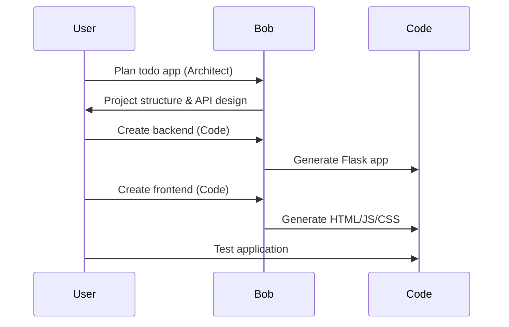

# Building a Todo Application with Bob

## Overview

In this lab, you'll learn to use Bob's AI-powered features to build a complete full-stack todo application from scratch. You'll experience Bob's different modes, auto-approvals, literate coding, and more.

### Project Structure

```text
├── simplae-app-development/           # Lab folder
│   ├── README.md                      # Lab 1 instructions
│   ├── starter/                       # Starting point files
│   │   └── .gitkeep
│   ├── solution/                      # Complete solution
│       ├── backend/
│       │   ├── app.py
│       │   ├── requirements.txt
│       │   ├── models.py
│       │   └── database.py
│       └── frontend/
│           ├── index.html
│           ├── styles.css
│           └── app.js
```

### What You'll Build

A full-stack todo application with the following technology stack:

```text
Frontend:          Backend:           Tools:
- HTML5            - Python 3.8+      - Bob AI
- CSS3             - Flask            
- JavaScript       - SQLite           
```

By the end of this lab, you will:

✅ Understand Bob's three modes (Architect, Code, Ask)  
✅ Use auto-approvals for rapid development  
✅ Practice literate coding techniques  
✅ Build a complete full-stack application  

### Prerequisites

Before starting, ensure you have:

- [ ] Python 3.8+ installed
- [ ] Node.js 14+ installed (for npm)
- [ ] Bob installed and running

### Lab Flow



1. **Introduction & Setup**  
   - Overview of Bob modes
   - Project initialization
   - Directory structure creation

2. **Backend Development**  
   - Use Architect mode to plan API structure
   - Switch to Code mode for implementation
   - Create Flask app with REST endpoints
   - Implement SQLite database models
   - Demonstrate auto-approvals for rapid iteration

3. **Frontend Development**  
   - Create HTML structure
   - Implement JavaScript for API interaction
   - Add CSS styling
   - Use literate coding to explain complex logic

4. **Testing & Verification**  
   - Run the application
   - Test CRUD operations
   - Verify functionality

---

## Part 1: Plan the application

> ![Note]
> For simplicity, You may want to change into the directory where this lab is hosted. Tell Bob to switch into the appropriate directory. For example: `switch to the labs/handoff-labs/simple-app-development directory`


1. **Switch to Plan Mode** and ask Bob:

    ```text
    I want to create a todo application in the todo-starter directory with a Python Flask backend and JavaScript frontend.
    Please help me plan:
    1. Project directory structure
    2. API endpoints needed
    3. Database schema
    4. Technology stack recommendations
    ```

    > **IMPORTANT NOTE:** Bob might ask you to read the existing project structure or what files are alraedy in place. In most cases, we would want to allow that so Bob has the context it needs. In this case, go ahead and only approve Bob's request to check if the `todo-starter` directory exists, and Reject Bob's other request.

    Before providing a plan, Bob will ask clarifying questions to understand your requirements better. This is a key differentiator—Bob lets you drive the process while making helpful suggestions.

    Bob might ask:
    - "How complex should the application be?"
    - "Which database would you prefer (SQLite, PostgreSQL, MySQL)?"
    - "Do you need user authentication?"
    - "Should we include additional features like categories or priorities?"

1. For this lab, respond with basic requirements:

    ```text
    - Simple/basic complexity
    - SQLite database (no installation needed)
    - No user authentication
    - Basic CRUD operations only
    ```

    > **IMPORTANT NOTE:** Bob might ask you to read the files in the solution directory.Reject Bob's  request since we dont want to influence it with the existing solution files.

    **Expected Response from Bob:** After your clarifications, Bob should provide:

    - Directory structure with backend/ and frontend/ folders
    - REST API endpoints (GET, POST, PUT, DELETE)
    - Database schema for todos (id, title, description, completed, created_at)
    - Recommendations for Flask, SQLite, CORS, etc.

1. Bob should provide a plan for the development process. Approve the request to save this plan (you can also approve Bob's request to save other planning artifacts).

---

## Step 2: Backend Development

1. Switch Bob to `Code` mode and prompt it with the following:

    ```text
    Create the Flask backend for the todo app with the following files:
    1. app.py - Main Flask application with CORS enabled
    2. models.py - SQLAlchemy Todo model
    3. database.py - Database initialization
    4. requirements.txt - Python dependencies

    The Todo model should have: id, title, description, completed (boolean), created_at (timestamp)
    ```

1. Bob should generate these files in the `backend/` directory. Review each file as Bob creates them.

1. Feel free to turn on **Auto-approvals**, which will allow Bob to make multiple changes without asking for confirmation each time. To enable auto-approvals:
    1. Look for auto-approval settings in Bob
    2. Enable for this session
    3. Bob will now create multiple files rapidly

1. Implement the REST API Endpoints, prompt Bob with the following:

    ```text
    Implement the following REST API endpoints in app.py:
    - GET /api/todos - List all todos
    - POST /api/todos - Create a new todo
    - PUT /api/todos/<id> - Update a todo
    - DELETE /api/todos/<id> - Delete a todo

    Include proper error handling and JSON responses.
    ```

1. Bob should create the implementation following files in the `backend/` directory. Feel free to compare them with the files in the `solution` directory.

1. Test the backend setup using a virtual environment. Run the following commands in your terminal.

    ```bash
    # Navigate to backend directory
    cd todo-starter/backend

    # Create virtual environment
    uv venv

    # Activate virtual environment
    source .venv/bin/activate

    # Install dependencies
    uv pip install -r requirements.txt

    # Run the application
    python app.py
    ```

**Note:** Remember to activate the virtual environment every time you work on the project. You'll know it's activated when you see `(venv)` in your terminal prompt.

1. Alternatively, you can ask Bob to do that for you. **Prompt for Bob:**

    ```text
    Run the backend application and test it with 1 sample curl command per each API endpoint.
    ```

1. The server should start on `http://localhost:5000`

**✅ Checkpoint**: Backend is running without errors.

---

## Step 3: Frontend Development

1. Now let's create the user interface using JavaScript. Still in `Code` mode, prompt Bob with the following:

    ```text
    Create the frontend for the todo app with:
    1. index.html - Main HTML structure with a clean, modern design
    2. styles.css - Responsive CSS styling
    3. app.js - JavaScript for API interactions

    Include:
    - Input field for new todos
    - List to display todos
    - Buttons for complete and delete actions
    - Responsive design for mobile and desktop
    ```

1. Bob will go ahead and start creating the front end implementation files.

1. Lets explore literate coding, which can be used to have Bob write code and explain itself through comments and clear structure. **Prompt  Bob:**

    ```text
    In app.js, use literate coding to explain:
    - How the API calls work
    - Why we use async/await
    - How error handling is implemented
    - The purpose of each function

    Add detailed comments that would help a beginner understand the code.
    ```

1. Bob should create the implementation following files in the `frontend/` directory. Feel free to compare them with the files in the `solution` directory.

1. Test the frontend, by opening `frontend/index.html` in your browser:

**✅ Checkpoint**: Frontend loads and displays the UI.

---

## Step 4: Testing & Verification (5 minutes)

1. Let's test the complete application end-to-end.

1. Start the Backend

    ```bash
    # Navigate to backend directory
    cd backend

    # Activate virtual environment (if not already activated)
    source .venv/bin/activate

    # Run the application
    python app.py
    ```

1. Server should be running on `http://localhost:5000`

1. Open `frontend/index.html` in your browser.

1. Run the following tests:

    **Create a Todo:**
    1. Enter a title: "Learn Bob"
    2. Enter a description: "Complete all three labs"
    3. Click "Add Todo"
    4. ✅ Todo appears in the list

    **Mark as Complete:**
    1. Click the "Complete" button on a todo
    2. ✅ Todo shows as completed (strikethrough or checkmark)

    **Delete a Todo:**
    1. Click the "Delete" button on a todo
    2. ✅ Todo is removed from the list

    **Refresh Page:**
    1. Refresh the browser
    2. ✅ Todos persist (stored in database)

1. [Optional] You can also verify the database, to ensure the Todos are being stored in the database.

    ```bash
    # In backend directory
    python
    >>> from app import app, db
    >>> from models import Todo
    >>> with app.app_context():
    ...     todos = Todo.query.all()
    ...     for todo in todos:
    ...         print(f"{todo.id}: {todo.title}")
    ```

✅ Todos are stored in the database

---

## Congratulations! 🎉

You've successfully completed Lab 1! You've learned to:

- ✅ Use Bob's Architect mode for planning
- ✅ Use Bob's Code mode for implementation
- ✅ Enable and use auto-approvals
- ✅ Apply literate coding principles
- ✅ Integrate GitHub using MCP servers
- ✅ Build a complete full-stack application

### Key Takeaways

#### Bob's Modes

- **Plan**: Perfect for planning and design decisions
- **Code**: Best for implementation and file creation
- **Ask**: Great for learning and understanding

#### Auto-Approvals

- Speeds up development significantly
- Useful for creating multiple related files
- Always review the generated code

#### Literate Coding

- Makes code self-documenting
- Helps team members understand your code
- Useful for learning and teaching

> **💡 Behind the Scenes: Intelligent Resource Optimization**
> While you've been building this app, Bob has been automatically selecting the right AI model for each task—using powerful models for complex architecture decisions and lighter models for simple file operations. This [automatic model selection](../bob-differentiators.md#automatic-model-selection) optimizes both quality and cost without you having to think about it. You can save up to 60% on AI costs while maintaining excellent results!

## Next Steps

### Enhance Your App

Try these improvements:

1. Add todo categories or tags
2. Implement due dates
3. Add user authentication
4. Create a priority system
5. Add search and filter functionality
6. Integrate with GitHyb MCP to version control your application.

### Additional Resources

- [Flask Documentation](https://flask.palletsprojects.com/)
- [JavaScript Fetch API](https://developer.mozilla.org/en-US/docs/Web/API/Fetch_API)
- [SQLAlchemy Documentation](https://docs.sqlalchemy.org/)
- [Bob Documentation](https://bob-docs-url)

---

*Adapted from Client Engineering `bob-intro-labs`. Last Updated: May 2026*
