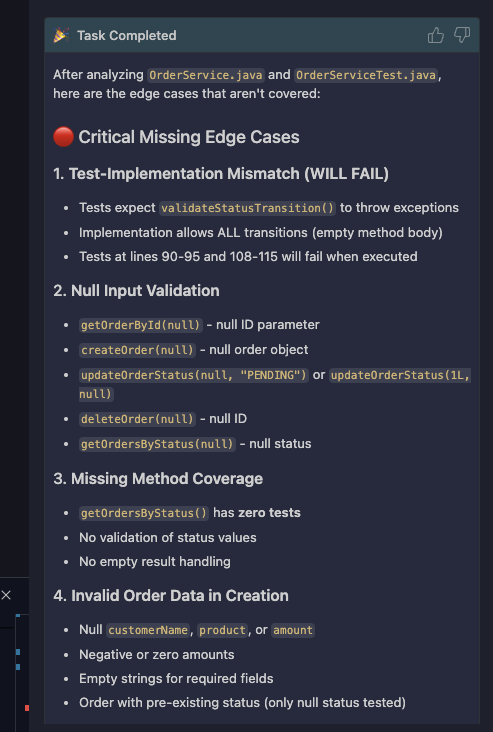

# Lab 2 — Unit Testing with Bob

## Table of Contents

- [Overview of Lab 2](#overview-of-lab-2)
  - [What you'll build in Lab 2](#what-youll-build-in-lab-2)
  - [What you'll reuse from Lab 1](#what-youll-reuse-from-lab-1)
- [Before you start](#before-you-start)
- [Part 1 — Create the `java-unit-test-mode` IDE mode](#part-1--create-the-java-unit-test-mode-ide-mode)
- [Part 2 — Use the mode to add a test](#part-2--use-the-mode-to-add-a-test)
- [Part 3 — Create the `pipeline-test-failure-analyzer` mode](#part-3--create-the-pipeline-test-failure-analyzer-mode)
- [Part 4 — Build the `Unit Tests` stage](#part-4--build-the-unit-tests-stage)
- [Part 5 — Push and watch](#part-5--push-and-watch)
- [Part 6 — Stress-test the mode (optional)](#part-6--stress-test-the-mode-optional)
- [Stuck?](#stuck)

---

## Overview of Lab 2

You'll add automated unit-test analysis to the pipeline using the same prompt-then-mode loop you practiced in Lab 1 — one custom mode for writing tests in your IDE, another for diagnosing failures in CI.

### What you'll build in Lab 2

1. **A custom Bob mode for writing unit tests** (`java-unit-test-mode`) — built with **Mode Writer**; an IDE specialist that knows JUnit 5 + Mockito + the conventions of this repo's existing tests.

2. **An IDE-side test addition** — using your new mode, find an uncovered edge case and write a test for it. Bob runs the test for you and iterates if it fails.

3. **A custom Bob mode for analyzing test failures** (`pipeline-test-failure-analyzer`) — read-only pipeline mode that diagnoses failing tests and proposes fixes.

4. **The `Unit Tests` stage** — uses the **Jenkins Pipeline Integration** mode to write a stage that runs `mvn test`, publishes JUnit results, and (only when something fails) hands the surefire reports to Bob for analysis.

By the end, a failing test won't just turn the build yellow — Bob will explain what broke, why, and how to fix it, all in plain English in your Jenkins console.

### What you'll reuse from Lab 1

- **The `askBob` helper** — already in your Jenkinsfile. Lab 2's stage calls it with the new test-failure-analyzer mode.
- **The `Jenkins Pipeline Integration` mode** — same mode you used to write the PR Review stage. It already knows how to wire up askBob, archive output, and use `catchError` for resilience.

---

## Before you start

- [ ] Lab 1 complete (your Jenkinsfile already has a PR Review stage and the askBob helper)
- [ ] You're on your working branch (e.g. `user1-labs`)

---

## Part 1 — Create the `java-unit-test-mode` IDE mode

Start a new task and switch to **Mode Writer** mode. 

The prompt below is a starter for a Java unit-test specialist. Treat it as a base, not a fixed script: anything you want every test you write to follow (naming convention, `@DisplayName`, given/when/then comments, fixture builders, parameterized tests) belongs in this prompt rather than the per-test call.

```
Write a custom mode with slug `java-unit-test-mode`. Append it to @.bob/custom_modes.yaml — don't overwrite anything else.

Job: write Java unit tests for this Spring Boot application. JUnit 5 + Mockito + AssertJ. 
Before writing a new test, read the related existing tests under @order-service/src/test/ to match this repo's conventions (assertion library, mocking style, naming pattern, fixture setup).

Tool groups:
  - read
  - edit

  Add some instructions files for the mode. The instruction files should be Markdown files, not xml. 
```

Notice the prompt above tells the **Mode Writer** mode to write Markdown files instead of XML this time. Both are acceptable practice with Bob. 

Feel free to explore the XML files and see what Bob decided to generate.

Once Bob finishes, **restart Bob IDE** so the new mode appears in your mode dropdown — IDE modes are loaded at IDE startup.

---

## Part 2 — Use the mode to add a test

In a new task, switch to **Ask** mode and ask:

> "Read @OrderService.java and @OrderServiceTest.java. What edge cases aren't covered?"

Bob will show you something similar to this:



Pick one of Bob's suggestions, like `getOrderById(null) - null ID parameter`. 

Then switch to **Java Unit Test** mode (your new mode) in the same task, and ask:

> "Write a test for [the edge case] and add it to @OrderServiceTest.java."

After Bob writes the tests, ask Bob to run the test (you may need to install maven).

> "Run the tests and ensure they pass."

Bob will ask to switch modes because we didn't give the unit test mode the `command` tool group. 

---

## Part 3 — Create the `pipeline-test-failure-analyzer` mode

Your test-writer mode is great for the IDE — it edits files and writes new tests. The pipeline needs something different: a read-only mode that diagnoses test failures and proposes fixes, with output formatted for a Jenkins console.

Start a new task and switch to **Mode Writer** mode. The prompt below is a starter — anything you want every test-failure diagnosis to do (output format, what to surface, what to skip as noise, tone) belongs here, not in the per-stage call.

```
Write a custom mode with slug `pipeline-test-failure-analyzer`. Append it to @.bob/custom_modes.yaml — don't overwrite anything.

Job: diagnose JUnit / Surefire test failures and propose fixes. Read the failure reports plus the relevant source files under @order-service/src/. For each failed test:
  - One sentence on what failed and where
  - Likely root cause (assertion mismatch, NPE, mock misconfiguration, timeout, wrong exception type, etc.)
  - Suggested fix with a short code snippet
  - Group related failures if they share a root cause

Output: plain text for a Jenkins console (no ANSI, no markdown tables). Sections: Summary, Failures, Suggested fixes. Short — if a single line says it, say it in a single line.

Tool groups: read only.
```

We didn't explicitly tell Bob to create rules files here, so it may not have. If you feel you want more detailed instructions for the mode, ask Bob in Mode Writer mode to expand the mode into rules files. 

Read-only is deliberate — a pipeline mode should do the minimum it needs to. No IDE restart needed: Bob loads `custom_modes.yaml` fresh from the workspace on every pipeline run.

---

## Part 4 — Build the `Unit Tests` stage

Start a new task, and switch to the **Jenkins Pipeline Integration** mode. This is the same mode you used in Lab 1's Part 4 — it knows about `askBob`, the build-tools container, output archiving, and `catchError` resilience patterns. Rules live in `.bob/rules-jenkins-bob-integration/` if you want to look.

Paste the following prompt:

```
Add a "Unit Tests" stage to @Jenkinsfile right after the PR Review stage. The stage should:

- Run `mvn test` inside order-service/ in the build-tools container, capturing the result so the pipeline continues even if tests fail
- Publish JUnit results from order-service/target/surefire-reports/*.xml
- If tests failed, call askBob with the pipeline-test-failure-analyzer mode and a short prompt asking Bob to analyze the surefire reports under order-service/target/surefire-reports/ alongside the relevant source files under order-service/src/
- Save the analysis to bob-test-analysis.md and archive it as a build artifact
```

---

## Part 5 — Push and watch

The Unit Tests stage only triggers Bob's analysis when a test fails — so to see it in action, deliberately break a test before pushing. 

On line 48 of `order-service/src/test/java/com/example/service/OrderServiceTest.java`, we have the following assertion:

```java
assertThat(orders).hasSize(1);
```

Change that to:

```java
assertThat(orders).hasSize(2);
```

Then commit and push:

```bash
git add Jenkinsfile .bob/ order-service/
git commit -m "Lab 2 — Unit Tests stage + pipeline-test-failure-analyzer mode"
git push
```

In Jenkins, click **Build Now** and watch the console.

Expected:

- `Checkout` and `PR Review` turn green
- `Unit Tests` turns **yellow (UNSTABLE)** — the failing test is recorded, but the pipeline continues
- Jenkins's Test Results link surfaces the failure with the exact assertion message
- Bob's analysis stage runs; the console shows root cause + suggested fix between banner lines
- `bob-test-analysis.md` appears under **Build Artifacts**
- Pipeline ends UNSTABLE (yellow), not red

Open the archived artifact for a persistent record of Bob's diagnosis. Look into the build artifact and see if Bob found the failed test you added. 

Once you've seen it work, revert the broken test and push again to get back to green.

---

## Part 6 — Stress-test the mode (optional)

Introduce different kinds of test failures and see how Bob's diagnosis changes:

- **NPE** — pass `null` to a method that doesn't expect it
- **Mock misconfiguration** — `when(mock.foo()).thenReturn(...)` for a method that's never called, or a missing `verify`
- **Wrong exception type** — assert one exception, throw another
- **Timeout / infinite loop** — an unbounded loop caught by a JUnit timeout
- **Order-dependent failures** — two tests sharing mutable state

Did Bob's root-cause guess match yours? If it mis-diagnosed something obvious, that's a signal to refine the rules in `.bob/rules-pipeline-test-failure-analyzer/` — tighten what patterns count as which kind of failure.

---

## Stuck?

- **Pipeline fails with something like `askBob: method not found`.** The helper got moved into the `pipeline { }` block somehow. Move it back outside.
- **Bob stage runs but says the mode wasn't found.** Check (a) `.bob/custom_modes.yaml` contains the slug `pipeline-test-failure-analyzer`, (b) you're passing that exact string to `askBob`, (c) you committed and pushed `.bob/`. Bob reads `custom_modes.yaml` fresh from the workspace on every run.
- **`mvn test` fails the stage hard (red, not yellow).** The mode forgot to wrap the test step in `catchError`. Without it, Maven's non-zero exit code kills the pipeline before Bob ever runs. The `Jenkins Pipeline Integration` mode's rules cover this — re-prompt the mode to add `catchError(buildResult: 'UNSTABLE', stageResult: 'UNSTABLE')` around the `mvn test` call.
- **`junit` step says "no test reports".** The path is wrong. It should be `order-service/target/surefire-reports/*.xml` — verify the glob matches what `mvn test` actually wrote.
- **Bob's analysis runs even when tests pass.** Bob is unconditionally invoked. Move the `askBob` call inside an `if` that checks for failures (e.g., `if (currentBuild.result == 'UNSTABLE')`) so it only runs when there's something to diagnose.
- **Bob's output is too generic ("the test failed because the assertion failed").** The rules aren't constraining the analysis enough. Re-open Mode Writer and tighten the rules: require Bob to name the failing line, the expected vs. actual values, and a specific code-level fix.
- **`Jenkinsfile` broken?** Copy `labs/sre/lab2/Jenkinsfile.lab2solution` over your own `Jenkinsfile` and push. That's the reference state after Lab 2 (Lab 1 + Lab 2 stages).

---

When you're ready, open [LAB3_SECURITY_SCANNING.md](../lab3/LAB3_SECURITY_SCANNING.md).
